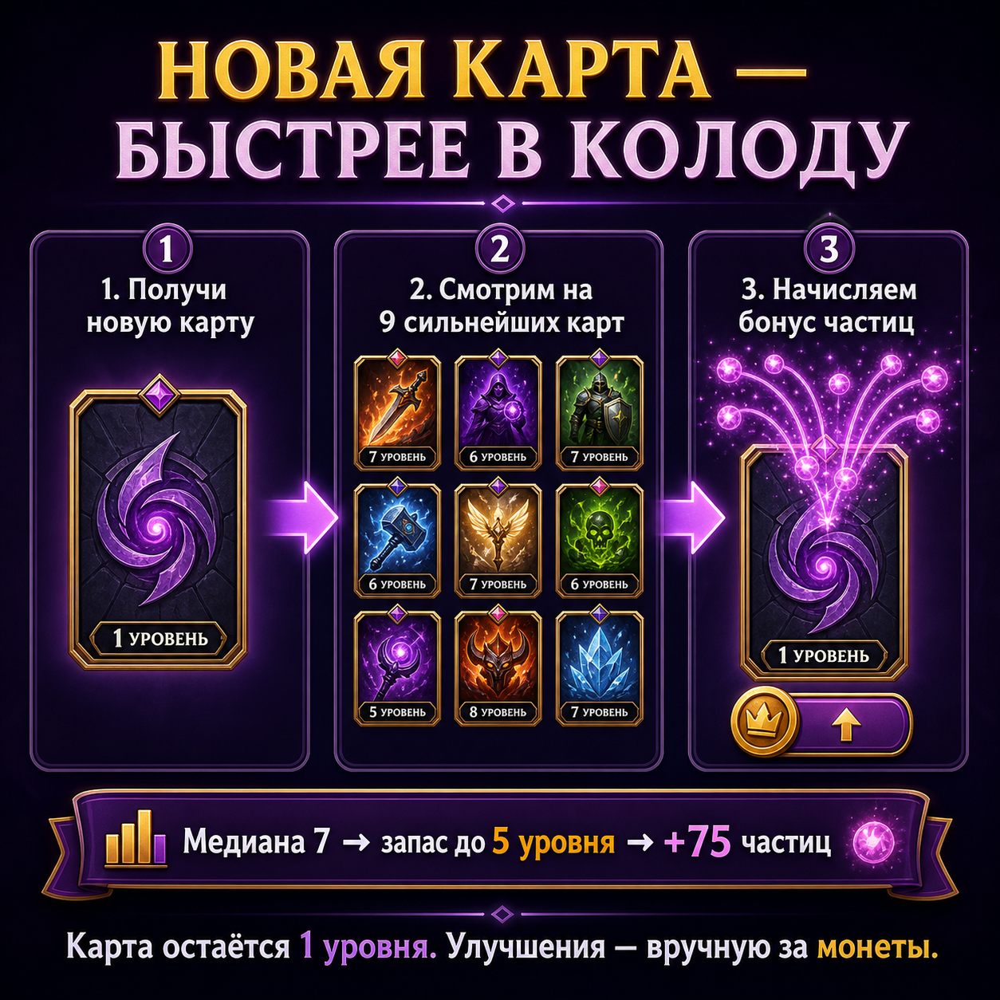

# Бонус освоения новой карты

Новая карта всегда появляется на **1 уровне**. Если коллекция уже прокачана,
карта получает стартовый запас частиц:

- система смотрит на девять наиболее прокачанных карт;
- определяет безопасный уровень догоняния;
- начисляет частицы для ручной прокачки до этого уровня;
- каждое повышение уровня игрок подтверждает самостоятельно и оплачивает
  монетами.

Бонус выдаётся только один раз — при первом получении карты. Дубликаты работают
по обычным правилам частиц.
