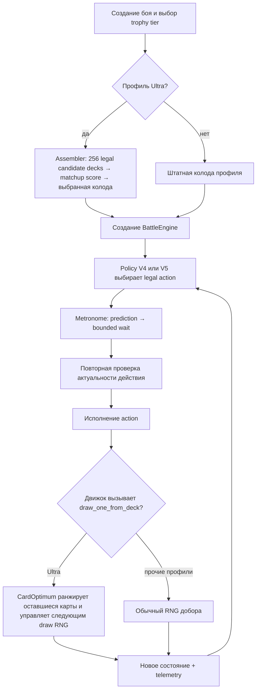

# ExtraLR V5 Family — итоговая карта моделей и пайплайна

**Срез состояния:** 2026-07-29

**Рабочая ветка:** `gpt/v5implantation`

**Назначение документа:** долговременная техническая справка по V5-family,
суб-моделям, данным, обучению, отбору и текущей интеграции.

> Этот файл описывает фактически сложившуюся систему, а не только исходный
> замысел. Июньские design/handoff-документы остаются исторически полезными,
> но часть решений в них устарела. При расхождении приоритет имеют текущий код,
> `ai/models/manifest.json`, model sidecars и результаты завершённых прогонов.
>
> Слова `stable`, `beta`, `experimental` и `preview` ниже описывают lifecycle
> артефакта в текущем manifest. Они сами по себе не доказывают, что diff
> закоммичен, артефакт развернут в production или прошёл все release gates.

---

## 1. Короткий итог

V5-family — это не три независимо обученные основные нейросети:

- **ExtraLR V5 Lite** — самостоятельный policy-checkpoint `u18500`;
- **ExtraLR V5** — самостоятельный Phase-C policy-checkpoint `h299`;
- **ExtraLR V5 Ultra** — тот же `h299`, дополненный Assembler V1,
  CardOptimum V1 и Metronome V1. Отдельного Ultra policy ONNX нет.

В продуктовой лестнице перед ними стоит **ExtraLR V4 Micro** — базовый бот для
новичков. V4 Lite, Opti и Max сохранены как benchmark references, но не
являются доступными live-профилями.

Основная тренировочная линия выглядела так:

```text
ruleset/codec foundation
  → короткий Phase A bootstrap
  → 30k-update Block B league
  → u29250 как post-B anchor, u18500 как Lite
  → Phase C: 299 human + 10 Luna
  → h299
  → Block D consolidation, отклонённый по regression gates
  → h299 остаётся policy winner
  → Assembler + CardOptimum превращают его в Ultra
  → крупный финальный benchmark
```

Ключевой вывод по качеству:

- чистый `h299` — не доказанное крупное усиление относительно `u29250`;
- релизное преимущество **Ultra** в значительной степени создаёт Assembler;
- CardOptimum даёт меньший, но положительный дополнительный эффект;
- Metronome отвечает за человекоподобный темп, а не за силу игры;
- TimeStamp и Nemesis пока являются отдельными сервисными направлениями и не
  участвуют в выборе боевого действия V5.

---

## 2. Легенда статусов

| Статус | Практический смысл в этом документе |
|---|---|
| `stable` | Артефакт предназначен для штатного runtime, но всё равно требует сохранённого provenance, воспроизводимости и release verification. |
| `beta` | Подключён или готов к подключению, однако имеет ограниченную валидацию, качество или field coverage. |
| `experimental` | Экспортирован и исследуется; не должен считаться штатной продуктовой функцией. |
| `preview` | Демонстрационный baseline с ограниченным доменом применимости; не готов к целевому production use case. |
| `concept` | Зафиксированная идея без завершённого обученного production-артефакта. |
| `historical` | Чекпоинт или прототип, важный для lineage/benchmark, но не текущий live-профиль. |

---

## 3. Полная карта текущих моделей

### 3.1. Игровые policy-профили

| Пользовательская модель | Policy-артефакт | Источник | Вход | Ассистенты | Текущая роль |
|---|---|---|---|---|---|
| **ExtraLR V4 Micro** | `extra-lr-v4-micro.onnx` | V4 `update_0330` | classic obs `1456`, actions `601×171` | Metronome | модель новичка, 0–299 кубков |
| **ExtraLR V5 Lite** | `extra-lr-v5-lite.onnx` | Block B `u18500` | V5 obs `7128`, actions `601×171`, mana head | Metronome | облегчённый V5, 300–1199 |
| **ExtraLR V5** | `extra-lr-v5.onnx` | Phase C `h299` | тот же полный V5 contract | Metronome | основной V5 без боевых ассистентов, 1200–4499 |
| **ExtraLR V5 Ultra** | использует `extra-lr-v5.onnx` | тот же `h299` | тот же полный V5 contract | Assembler + CardOptimum + Metronome | верхний композитный профиль, 4500+ |

**Важно:** Ultra находится в `manifest.composites`, а не в
`manifest.models`. Инструмент, перечисляющий только физические модели, пропустит
Ultra как пользовательский продукт.

### 3.2. Исторические и benchmark-модели

| Модель / alias | Статус | Для чего сохранена |
|---|---|---|
| **V5 postB-preV5 `u29250`** | historical anchor | Лучший выбранный checkpoint Block B и база Phase C. Не является текущим product tier. |
| **V4 Lite** | benchmark reference | Сравнение с ранней V4-линейкой. |
| **V4 Opti** | benchmark reference | Сравнение со средней V4-линейкой. |
| **V4 Max** | benchmark reference | Главный legacy strength anchor; не live-профиль. |
| **Phase-D snapshots u00250…u02000** | rejected | Все проиграли regression gates; ни один не заменил `h299`. |

### 3.3. Суб-модели и сервисные модели

| Модель | Статус | Назначение | Входит в бой |
|---|---|---|---|
| **ExtraLR Assembler V1** | `stable`, readiness `bootstrap_ready` | Выбрать статистически сильную 9-карточную колоду из разрешённого пула против конкретной колоды соперника. | Только Ultra, до старта боя. |
| **ExtraLR CardOptimum V1** | `beta`, readiness `candidate_ready` | Оценить потенциальную полезность следующей карты из оставшейся колоды в текущем состоянии. | Только Ultra, в механизме добора. |
| **ExtraLR Metronome V1** | `beta`, readiness `candidate_ready` | Предсказать человекоподобную задержку принятия решения. | Да, для всех текущих V4/V5-профилей. |
| **ExtraLR TimeStamp V1 Mono** | `experimental` | Оценить число ходов и длительность боя по одной колоде и population context. | Нет live call-site. |
| **ExtraLR TimeStamp V1 Duo** | `experimental` | Оценить число ходов и длительность по двум конкретным колодам. | Нет live call-site. |
| **ExtraLR Nemesis Lite Preview** | `preview` | Предсказать победителя по двум стартовым колодам, уровням и первому ходу. | Отдельный runtime, но не подключён к matchmaking. |
| **ExtraLR Nemesis Standard** | `concept + data collector` | Предсказывать исход human-vs-human с учётом колод, первого хода, профилей и истории игроков. | Обученной модели и live inference пока нет. |
| **Desirerer V1** | historical prototype | Старый weak-label draw scorer. Его практическую нишу занял CardOptimum. | Нет ONNX/manifest/live call-site. |

---

## 4. Общий V5 input/output contract

Финальный V5-contract отличается от ранней июньской схемы. Текущие размеры:

| Блок | Размер | Содержание |
|---|---:|---|
| Frozen V4-compatible base | 1456 | Публичное состояние, карты на столе, герои, ресурсы и classic features. |
| V5 global extras | 32 | Дополнительные глобальные признаки, включая mana-draw context. |
| Private zones | 2400 | 32 card slots × 75 признаков: собственные и вражеские рука/колода. |
| Rich history | 3240 | 20 событий × 162 признака. |
| **Итого observation** | **7128** | Полный V5 input. |

Action contract:

- максимум **601** candidate actions;
- **171** признак на candidate action;
- policy выдаёт `logits[601]` и `value`;
- добор маны реализован отдельным бинарным `mana_draw_logit`;
- mana draw не является «602-м действием».

Все V5-профили сейчас серверные и **omniscient**:

- получают собственные руку и упорядоченную колоду;
- получают руку и упорядоченную колоду соперника;
- получают последние 20 структурированных событий;
- используют отдельную голову решения о доборе маны.

Это осознанное преимущество серверного бота. Такой checkpoint нельзя без
переобучения считать perspective-limited моделью для клиента или честного
human-information режима.

V4 Micro использует classic contract и не получает identity скрытых карт
соперника.

---

## 5. Назначение основных V5-профилей

### 5.1. ExtraLR V5 Lite

**Checkpoint:** Block B `u18500`.

**Artifact:** `ai/models/extra-lr-v5-lite.onnx`.

**Product role:** первый V5-уровень после V4 Micro.

Lite — не уменьшенная архитектура и не perspective-limited модель. Она
использует тот же V5 input/output contract, что V5 и Ultra, но более ранний
checkpoint. Поэтому слово Lite означает продуктовый уровень силы, а не
сокращённый feature set.

В финальном V5-family H2H:

- чистый `h299` победил Lite со score rate 53.26%;
- Ultra победил Lite со score rate 81.10%.

### 5.2. ExtraLR V5

**Checkpoint:** Phase C `h299`.

**Artifact:** `ai/models/extra-lr-v5.onnx`.

**Product role:** основной V5 policy без Assembler/CardOptimum.

`h299` обучен поверх `u29250` с использованием:

- 299 завершённых human-vs-V5 боёв;
- 10 deep-valid Luna боёв с пониженным весом;
- только принятых обучающих действий;
- отдельного mana-draw target.

MiniMax M3 в финальный policy replay не вошёл: контролируемое сравнение смеси
на 50 боях показало регрессию.

Первичный H2H `h299` против `u29250` дал 259–248–5 в 512 боях, score 51.074%,
но доверительный интервал включал 50%. В более широком финальном gauntlet
`h299` показал 49.51% против `u29250`. Поэтому корректная формулировка:

> `h299` — выбранный Phase-C policy и база Ultra, но его устойчивое
> самостоятельное превосходство над post-B `u29250` не доказано.

### 5.3. ExtraLR V5 Ultra

**Policy:** тот же `h299`.

**Composite:** Assembler V1 + CardOptimum V1 + Metronome V1.

**Manifest status:** `beta_assisted`.

Ultra усиливает систему на двух разных уровнях:

1. Assembler меняет исходную колоду бота под известную колоду соперника.
2. CardOptimum влияет на выбор карты при разрешении добора.
3. Metronome меняет только временной профиль.

Ultra — это системная модель, поэтому её нельзя экспортировать одним policy
ONNX без потери смысла. Для воспроизводимости нужны как минимум четыре
артефакта и их общая версия orchestration:

- `extra-lr-v5.onnx`;
- `extra_lr_assembler_v1.onnx`;
- `extra_lr_cardoptimum_v1.onnx`;
- `extra_lr_metronome_v1.onnx`.

---

## 6. Как работает Ultra в runtime



CardOptimum участвует не только в battlecry-эффектах: wrapper обслуживает
обычный добор в конце хода, `mana_draw` и `battlecry_draw_card`.

Fail behavior:

- assistants загружаются независимо;
- inference-сбой CardOptimum после инициализации должен быть fail-open;
- Metronome имеет ограниченный fallback delay;
- TimeStamp не должен отключать policy или Metronome;
- Ultra setup требует присутствия обязательных Assembler/CardOptimum
  компонентов, иначе профиль не должен незаметно деградировать до обычного V5.

---

## 7. Суб-модели подробно

### 7.1. Assembler V1

**Задача:** ранжирование legal 9-card decks против конкретного opponent deck.

**Контракт:**

- input `features[2753]`;
- candidate deck, opponent deck, card levels, allowed pool и scalars;
- 50×50 bilinear interaction для pairwise matchup effects;
- output `matchup_score`.

**Runtime:**

- вызывается до создания боя;
- оценивает детерминированный набор из 256 legal candidate decks;
- устанавливает лучшую найденную колоду бота;
- не гарантирует глобальный комбинаторный optimum.

**Данные и качество:**

- финальный dense source: 20,000 synthetic battles, 19,971 clean;
- 50/50 карт;
- текущий interaction training добавлял 1000 h299 matchup cells и 500
  post-D/source rows;
- validation MAE улучшался относительно base;
- test MAE около 0.220 оказался чуть хуже base около 0.217.

Несмотря на неоднозначность чистой regression metric, реальный intervention
эффект в paired ablation оказался крупным:

- основной эффект в первоначальной ablation: **+7.81 pp**;
- в расширенной winner ablation: **+8.41 pp**.

**Текущий вывод:** пригоден как продуктовый intervention в Ultra, но его
model-card/readiness `bootstrap_ready` нужно сохранять. `stable` не следует
читать как «статистически исчерпывающе откалиброван».

### 7.2. CardOptimum V1

**Задача:** оценка следующей наиболее полезной карты в текущем состоянии.

**Контракт:**

- input `features[82]`;
- actor-private и opponent-public признаки;
- output `card_score`.

**Runtime:**

- ранжирует карты, остающиеся в собственной колоде;
- per-match RNG wrapper сохраняет расход базового RNG;
- форсирует один выбранный top draw;
- не меняет policy logits напрямую.

**Данные и качество:**

- 9,852 counterfactual states;
- 2,906 informative states;
- informative test: 250;
- top-1 accuracy: 44.4%;
- mean regret: 0.213.

Paired ablation:

- первоначальный main effect: **+0.89 pp**;
- расширенный main effect: **+2.10 pp**.

**Текущий вывод:** эффект положительный, но гораздо меньше Assembler. Статус
`beta` оправдан: нужны дополнительные действительно informative
counterfactual states, более крупный held-out test и сохранённый training
checkpoint.

### 7.3. Metronome V1

**Задача:** заменить фиксированный hard-code ожидания прогнозом, похожим на
человеческое время принятия решения.

**Контракт:**

- 26 признаков pre-action состояния и сложности решения;
- output `predicted_log_ms`;
- bounded sampling в диапазоне 100–25,000 ms.

**Тренировочные данные:**

- 12,083 usable human timing labels;
- 1,262 holdout decisions;
- artifact holdout MAE 721.6 ms против baseline 892.3 ms.

**Field pilot:**

- 52 свежих решения, 2 боя, 2 группы;
- MAE 608.4 ms;
- hard-coded midpoint 3–6 s имел MAE 2627.1 ms.

**Текущий вывод:** технический pilot успешен, но полевой gate не закрыт.
Требуется не менее 500 свежих решений минимум из 10 групп. Participant key
отсутствовал, поэтому текущий group/session split является proxy.

### 7.4. TimeStamp V1 Mono

**Задача:** оценить ожидаемые ходы и длительность боя по одной колоде.

**Контракт:**

- `turn_features[101]`;
- `duration_context[10]`;
- predicted log turns и duration.

На малом holdout duration MAE не превзошёл baseline:

- модель около 66.9–68.0 s;
- baseline 66.8 s.

**Вердикт:** `experimental`, `optional_not_shipped`. В текущей игре live
call-site отсутствует.

### 7.5. TimeStamp V1 Duo

**Задача:** тот же прогноз по двум конкретным колодам.

**Контракт:**

- `turn_features[201]`;
- `duration_context[19]`;
- predicted log turns и duration.

На 32 holdout battles point estimate был немного лучше baseline:

- duration MAE около 64.2–65.0 s;
- baseline 66.8 s;
- bootstrap interval разницы пересекал ноль.

**Вердикт:** перспективнее Mono, но всё ещё `experimental`. Для live gate нужны
не менее 30 свежих завершённых боёв и проверка unseen deck pairs.

---

## 8. Training pipeline: план и фактическое исполнение

Июньский design зафиксировал схему:

```text
Block -1 → Block 0 → A → B → C → D → E1
```

Главным принципом был отбор по external benchmarks, а не по training loss.
Этот принцип сохранился. Конкретная lineage изменилась.

| Этап | Изначальная цель | Что произошло фактически | Итог |
|---|---|---|---|
| **Block -1** | Заморозить ruleset, новые карты, mana draw и Rust/Python parity. | 50-card/mana-draw parity и необходимые проверки были завершены. | foundation accepted |
| **Block 0** | V5 encoder, history/private state, mana head, warm start, offline bridge. | Реализованы obs 7128, 601-action scorer, отдельная mana head и offline loader. | foundation accepted |
| **Phase A** | 1–3k human pilot → BC → короткий PPO bootstrap с V4 warm start. | Инфраструктура реализована, но финальная lineage пошла от random-only fresh-init Phase-A run; pilot/BC и warm start в неё не вошли. | plan diverged |
| **Block B** | 30k league, snapshot/exploit/V4 anchors, external selection. | Выполнен 30k-update league. `u29250` выбран как post-B; `u18500` сохранён как Lite. | completed |
| **Phase C** | 3–5k human battles и AWAC/CRR replay. | Зафиксированы 299 human battles + 10 Luna; MiniMax исключён из финального policy mix. Получен `h299`. | completed with smaller corpus |
| **Block D** | Короткая post-C consolidation league. | Выполнено 2000 updates; ни один post-D snapshot не прошёл gates. | attempted and rejected |
| **E1** | Формальный tournament + threshold table + human QA + ship. | Machinery реализована, но отдельный полный production E1/human-QA artifact не найден. Релизный выбор сделан большим отдельным benchmark. | partially evidenced |

### 8.1. Phase A caveat

Финальная модель не должна описываться как:

> «V4 warm-start → human pilot BC → PPO → Block B».

Фактический источник Block B — Phase-A `update_00100` из random-only
fresh-init run. Это важная разница для воспроизводимости и анализа причин
качества.

### 8.2. Block B

Фактический результат:

- `u29250` выбран как лучший post-B-preV5 checkpoint;
- reported selection: около 80.5% против V4 Max;
- H2H против `u18500`: около 57.62%;
- `u18500` сохранён не как победитель Block B, а как будущий V5 Lite tier.

### 8.3. Phase C

Frozen human corpus:

- 299 завершённых canonical human-vs-V5 боёв;
- 72 группы;
- 184 победы людей, 115 побед V5, 0 ничьих;
- 299/299 deep-valid;
- 50/50 карт;
- 24,076 action rows;
- 24,060 accepted rows;
- 16 rejected attempts сохранены для аудита, но исключены из targets;
- 12,511 accepted human policy targets;
- 1,469 human mana-draw targets;
- 12,083 usable human decision-time labels.

Итоговый policy training:

- 299 human battles;
- 10 deep-valid Luna battles;
- 12,818 policy rows;
- 1,485 mana-draw rows;
- 110 optimizer updates после исключения padding;
- 0 unresolved rows;
- checkpoint `h299`.

Luna была включена с меньшим весом. MiniMax M3 был полезен как диагностика
environment/player orchestration, но не прошёл контролируемый gate для
финального policy update.

### 8.4. Block D

Block D действительно запускался:

- 2000 updates;
- 128 environments;
- полный 50-card/mana-draw ruleset;
- источник `h299`;
- anchors `u29250` и `u18500`.

Все post-D snapshots получили `selection_eligible=false`. Победителем
screening остался исходный `phaseC-h299`, поэтому создавать отдельную
«post-D Ultra policy» некорректно.

### 8.5. E1 и финальный отбор

Формальный E1 pipeline реализован, но его smoke использовал fake
runner/loader и bootstrap export. Отдельного завершённого production
threshold-table + human-QA артефакта в просмотренном run tree нет.

Фактическое release decision опирается на:

- large independent benchmark;
- V5-family H2H;
- flagship Ultra-vs-V4-Max;
- paired Assembler/CardOptimum ablation;
- terminal repair audit для редких stalemate cells.

---

## 9. Финальные benchmarks

Финальный benchmark включал **82,944 боя** в актуальной 50-card V5-среде:

| Блок | Бои |
|---|---:|
| Ultra broad gauntlet | 13,312 |
| V5 h299 no-assist broad gauntlet | 12,288 |
| V5 Lite u18500 broad gauntlet | 12,288 |
| Три V5-family H2H пары | 12,288 |
| Ultra vs V4 Max flagship | 32,768 |
| **Всего** | **82,944** |

Во всех matchup использовались:

- 50-карточный catalog;
- mana draw;
- level 4;
- полные hand/deck/history inputs;
- обе policy seats;
- оба направления первого хода.

### 9.1. Flagship H2H

**Ultra vs V4 Max:**

- score rate: **88.01%**;
- 95% cluster bootstrap CI: **87.49–88.50%**;
- W-L-D: **28,834–3,927–7**;
- 32,768 боя;
- 0 invalid actions, execution errors и nonterminal rows.

### 9.2. V5-family H2H

| Матч | Score | W-L-D | Бои |
|---|---:|---:|---:|
| Ultra vs V5 h299 no-assist | **79.55%** | 3,258–837–1 | 4,096 |
| Ultra vs Lite u18500 | **81.10%** | 3,322–774–0 | 4,096 |
| V5 h299 no-assist vs Lite u18500 | **53.26%** | 2,179–1,912–5 | 4,096 |

### 9.3. Broad-gauntlet highlights

| Candidate | vs V4 Max | vs u29250 |
|---|---:|---:|
| Ultra | 89.45% | 75.59% |
| V5 h299 no-assist | 72.02% | 49.51% |
| Lite u18500 | 72.51% | 45.51% |

### 9.4. Что именно дало усиление Ultra

Paired 2×2 ablation, где остальные условия фиксировались:

| Intervention | Первичная ablation | Расширенная winner ablation |
|---|---:|---:|
| Assembler main effect | +7.81 pp | +8.41 pp |
| CardOptimum main effect | +0.89 pp | +2.10 pp |
| Обе против ни одной | +8.70 pp | +10.51 pp |

Следовательно:

- основной uplift Ultra даёт Assembler;
- CardOptimum добавляет небольшой положительный эффект;
- сила Ultra не должна приписываться только обучению policy `h299`.

Редкие deterministic stalemates были повторно проиграны с расширенными
лимитами и явно adjudicated как draws, а не автоматически записаны в
поражения кандидата.

---

## 10. ONNX и release caveat

Текущий `ai/models/extra-lr-v5.onnx` имеет SHA-256:

```text
0fc9600f4444a53b56cbac02db82a6ca48cc3f858fd2f8d13b950f7306a5f5e5
```

Он байт-в-байт совпадает с Phase-C ONNX
`extra_lr_v5_phaseC_candidate_h299.onnx`.

Phase-C export validation:

- finite outputs;
- 0 legal-argmax mismatches на 156 real states;
- 0 mana-draw-gate mismatches;
- max logit drift `7.32421875e-4`;
- project tolerance `1e-4` не выполнен;
- validation report имеет `passed=false`.

Это означает:

- на проверенной выборке поведенческий argmax и mana gate совпали;
- строгая численная parity не доказана;
- крупный benchmark выбранной системы не заменяет ONNX↔training-runtime
  parity gate;
- `status=stable` в manifest не является доказательством устранения этого
  расхождения.

Перед окончательным production release нужно либо:

1. устранить drift и повторить real-state validation; либо
2. обоснованно пересмотреть tolerance, зафиксировать rationale и подтвердить
   отсутствие behavioral divergence на значительно более широкой выборке.

---

## 11. Продуктовая лестница и routing

| Кубки | UI tier | Профиль |
|---:|---|---|
| 0–99 | `lite` | V4 Micro |
| 100–299 | `easy` | V4 Micro |
| 300–999 | `easy+` | V5 Lite |
| 1000–1199 | `medium-` | V5 Lite |
| 1200–1999 | `medium` | V5 |
| 2000–2999 | `medium+` | V5 |
| 3000–4499 | `hard-` | V5 |
| 4500–5999 | `hard` | V5 Ultra |
| 6000–7499 | `hard+` | V5 Ultra |
| 7500–8999 | `max-` | V5 Ultra |
| 9000+ | `max` | V5 Ultra |

Training UI показывает четыре профиля:

- ExtraLR V4 Micro;
- ExtraLR V5 Lite;
- ExtraLR V5;
- ExtraLR V5 Ultra.

V4 Micro выбран по умолчанию.

### 11.1. Runtime technical debt

1. **V5 selection сейчас фактически argmax.** Объявленные в trophy tiers
   `selection=softmax` и temperature не влияют на V5 hot path. Внутри одного
   policy checkpoint сложность меняют главным образом колода и уровни.

2. **V5 omniscience hardcoded.** `enemy_*_known` в profile config сейчас
   декларативны: одного переключения флага недостаточно, чтобы ограничить
   информацию.

3. **Metronome вызывается глобально.** `metronome_enabled` также не является
   полноценным runtime feature switch.

4. **Ultra — composite-only record.** Registry tooling должно читать и
   `models`, и `composites`.

5. **Текущее состояние — active dirty worktree.** Наличие работающих файлов и
   тестов не подтверждает commit, push или production deployment.

---

## 12. Production data contract для дальнейшего обучения

Текущая система собирает V5-compatible battle journals для:

- human-vs-bot;
- human-vs-human.

Canonical storage:

```text
<group>/
├── manifest.json
└── battles/<battle_id>/v5/
    ├── meta.json
    ├── turns.jsonl
    └── actions.jsonl
```

### 12.1. Policy labels

Обучающими демонстрациями человека считаются только строки:

```python
row.get("decision_source") == "human" and row.get("accepted") is True
```

Rejected attempts сохраняются для аудита, но не становятся policy targets.
Replacement bot и timeout actions также не считаются действиями человека.

### 12.2. Metronome labels

Используются только:

- human actions;
- uncensored decision time;
- окно 100–25,000 ms;
- время от доставки actionable state до следующего запроса;
- без reconnect/disconnect и невалидных наблюдений.

Автоматические действия хранят prediction/applied/fallback telemetry отдельно.

### 12.3. TimeStamp labels

Label — полная длительность завершённого боя:

- старт от `client_ready`, а не от queue/engine construction;
- финиш при terminal seal;
- abandoned/ongoing/aborted не становятся обычными targets;
- Mono использует одну колоду + context;
- Duo использует обе колоды.

### 12.4. Dataset integrity

Для дальнейшего Phase-C/retraining обязательны:

- complete terminal battle;
- `degraded=false`;
- корректный catalog/ruleset/weights provenance;
- полный `v5_history_events`;
- trace validation;
- исключение всех `accepted is not True` из targets;
- grouped split по battle/deck lineage;
- отсутствие train/validation/test leakage.

---

## 13. Nemesis family

Nemesis относится к той же боевой экосистеме данных, но не является V5 action
policy.

### 13.1. Nemesis Lite

**Цель:** оценить исход боя по:

- двум стартовым колодам;
- уровням карт;
- тому, какая сторона начинает.

Не использует profile history.

### 13.2. Nemesis Lite Preview

Текущий baseline:

- 19,848 complete model-vs-model simulations;
- 9,924 `u29250` и 9,924 `h299`;
- 1,464 unordered exact deck-pair groups;
- grouped split 13,804 / 2,884 / 3,160;
- test accuracy 83.96%;
- log loss 0.3690;
- ECE 0.0127;
- ONNX swap-equivariance/parity drift около `1e-7`.

Критическое ограничение:

- всего 2 draws во всём corpus;
- draw head фактически не обучен и не откалиброван;
- модель оценивает outcomes конкретной non-Ultra policy mixture;
- это не human-vs-human probability model.

Поэтому Preview нельзя использовать для human matchmaking без:

- human-vs-human fine-tune;
- player-disjoint и chronological holdouts;
- calibration analysis;
- draw/stalemate lane или явного binary contract;
- мониторинга feedback loop.

### 13.3. Nemesis Standard

**Планируемый input:**

- Lite base;
- pre-match wins/losses/trophies обеих сторон;
- de-identified recent battle history;
- actor/domain provenance;
- starting side.

**Текущий статус:**

- production collector и единый record contract реализованы;
- данные Lite и Standard не дублируются: `features.extended` опционально
  прикрепляется к Lite base;
- обученной Standard модели, ONNX и matchmaking call-site нет.

Допустимые домены:

| Домен | Lite | Standard |
|---|---|---|
| human-human | primary | primary при полном pre-match extended snapshot |
| human-bot | primary | только auxiliary/masked/domain-aware pretraining |
| model-model | primary | ineligible |

Результаты ботов нельзя напрямую экстраполировать на вероятность победы людей:
различаются качество действий, familiarity, AFK/surrender behavior, распределение
колод и профилей.

---

## 14. Что не входит в V5-family

### 14.1. Deferred V6 combat concepts

Эти идеи зафиксированы, но не должны молча добавляться в V5 runtime:

- shared combat-state encoder;
- **Tactician** — plan-horizon head;
- **LethalGuard** — forced-lethal verifier;
- **Oracle/value-confidence** — калиброванная оценка позиции и уверенности;
- **Sentinel** — anomaly guard для подозрительных решений;
- live-калибровка TimeStamp;
- **DeckDoctor / UpgradeOptimum** — рекомендации колоды/улучшений с combat eval;
- **BalanceProbe** — симуляция патчей и баланса;
- **ModePilot** — выбор mode-specific policy;
- **Mimic** — контролируемые human-style варианты.

Перед синтетической разметкой этих направлений нужно исправить полный
deterministic RNG control: environment RNG и module-level `random` сейчас могут
нарушать истинную парность семян.

### 14.2. ExtraUX backlog

Navigator, ScreenPrefetch, ReturnClock, IdeaGraph, Support Copilot, Journey,
Onboarding Assist, Milestone, QuestCurator, SquadFit, SocialConnect,
FeedCurator, StabilityRadar, Collection Curator и Librarian относятся к
небоевому ExtraUX-направлению и не являются V5-family.

---

## 15. Grokking: что можно и нельзя утверждать

В ходе проекта обсуждалась гипотеза воспроизведения grokking-like эффекта на
ограниченном RLHF corpus. Текущие артефакты не доказывают такой эффект:

- не было заранее определённого grokking protocol;
- нет показанной долгой фазы memorization с последующим delayed generalization;
- финальный uplift Ultra в основном объясняется assistants;
- `h299` не получил убедительного широкого преимущества над `u29250`.

Поэтому в model cards нельзя заявлять, что V5 «прошёл grokking». Для отдельного
эксперимента нужны fixed train/held-out distributions, длинная training curve,
контроль capacity/regularization и заранее определённая delayed-generalization
метрика.

---

## 16. Открытые gates и приоритеты

### P0 — сохранить и сделать воспроизводимым

- Закоммитить/сохранить текущие V5 runtime files, ONNX, manifest, docs и tests.
- Сохранить training NPZ/provenance для CardOptimum, Metronome и TimeStamp.
- Зафиксировать единый Ultra bundle version, а не четыре несвязанных файла.
- Повторить strict V5 ONNX real-state parity.

### P1 — закрыть продуктовые beta gates

- Metronome: ≥500 свежих решений из ≥10 групп.
- CardOptimum: больше informative counterfactual states и held-out sample.
- Assembler: более сильный out-of-distribution deck-pair test.
- TimeStamp Duo: ≥30 свежих завершённых боёв и unseen deck-pair validation.
- TimeStamp Mono: не продвигать, пока не превосходит baseline.

### P2 — дальнейшее обучение

- Новую Phase-C итерацию запускать только после накопления нового
  deep-valid human corpus и определения external promotion gate.
- Human demonstrations считать по качеству accepted actions, coverage,
  participant diversity и mana-draw/new-card coverage, а не только по числу
  боёв.
- Semi-synthetic data принимать только после controlled mix ablation.
- Не возвращать MiniMax в main-policy mix автоматически.
- Для Nemesis Standard сначала накопить human-human calibration data.

---

## 17. Карта артефактов и источников

### Текущий integration worktree

- `ai/models/manifest.json` — canonical runtime inventory, hashes и статусы.
- `infrastructure/config.py` — product profiles и trophy tiers.
- `ai/train_v2/v5_contracts.py` — размеры V5 contract.
- `ai/train_v2/obs_v5.py` — V5 observation encoder.
- `ai/bot_brain.py` — policy hot path, omniscience и action selection.
- `ai/aux_models.py` — runtime Assembler/CardOptimum/Metronome/TimeStamp.
- `ai/nemesis_lite_preview.py` — standalone Nemesis Lite Preview runtime.
- `web/server.py` — match setup, Ultra assistants и Metronome orchestration.
- `docs/V5_PRODUCTION_DATASET.md` — production V5 dataset contract.
- `docs/NEMESIS_DATASET_CONTRACT.md` — единый Lite/Standard Nemesis record.
- `docs/NEMESIS_LITE_PREVIEW_REPORT.md` — Preview training/evaluation.
- `docs/superpowers/specs/2026-07-28-extraarena-noncombat-model-backlog.md` —
  ExtraUX и deferred V6 boundary.

### Training worktree / local run artifacts

Корень:

```text
/Users/laveqox/Documents/ExtraArenaRaS/.claude/worktrees/glm-TrainV3.5Prep
```

Ключевые материалы:

- `TrainV3.5/BLOCK_MINUS1_COMPLETION.md`;
- `TrainV3.5/BLOCK0_FOUNDATION_COMPLETION.md`;
- `TrainV3.5/BLOCK_A_COMPLETION.md`;
- `TrainV3.5/runs/blockB_from_phaseA_p2accepted100_parallel_20260714_210400/`;
- `TrainV3.5/runs/phase_c_human_freeze_u29250_299_20260727/`;
- `TrainV3.5/runs/phase_c_main_u29250_h299_luna10_paddingfix_20260727/`;
- `TrainV3.5/runs/extra_lr_v5_ultra_blockD_2000_20260727/`;
- `TrainV3.5/runs/phase_c_aux_ablation_4way_terminal_20260727/`;
- `TrainV3.5/runs/aux_field_test_v1_20260727/`;
- `TrainV3.5/runs/final_v5_release_bench_s256_h2h1024_flagship8192_20260727/`.

### Исторический design

- `docs/superpowers/specs/2026-06-27-extra-lr-v5-pipeline-design.md`;
- `docs/superpowers/specs/2026-06-27-extra-lr-v5-pipeline-handoff.md`.

В частности, утверждения июньского design о том, что V5 Lite и суб-модели
«out of scope», больше не описывают текущую систему.

---

## 18. Как обновлять этот документ

При каждом новом релизном кандидате нужно обновить:

1. checkpoint и ONNX SHA-256;
2. точную training lineage;
3. dataset manifest и exclusion accounting;
4. ONNX parity report;
5. независимые H2H и confidence intervals;
6. paired ablation ассистентов;
7. trophy routing и реально работающие feature switches;
8. field gates Metronome/TimeStamp;
9. manifest status;
10. commit/deployment evidence.

Нельзя повышать статус только потому, что:

- появился более поздний checkpoint;
- выросло число синтетических боёв;
- unit tests загрузили ONNX;
- manifest называет модель `stable`;
- один aggregate winrate вырос без парного контроля и разбивки по доменам.

---

## 19. Итоговая формулировка

- **ExtraLR V5 Lite** — ранний V5 checkpoint `u18500` для нижней части
  прогрессии.
- **ExtraLR V5** — Phase-C `h299`, обученный на 299 human и 10 Luna боях, без
  убедительно доказанного широкого превосходства над `u29250`.
- **ExtraLR V5 Ultra** — релизный победитель как композит `h299 + Assembler +
  CardOptimum + Metronome`, уверенно превосходящий V4 Max и остальные V5 tiers
  в финальном benchmark.
- **Assembler** — основной источник боевого uplift Ultra.
- **CardOptimum** — положительный beta-assistant меньшего масштаба.
- **Metronome** — перспективная beta-модель человекоподобного времени,
  нуждающаяся в большем field validation.
- **TimeStamp** — experimental service family, пока без live use.
- **Nemesis Lite Preview** — сильный offline winner baseline в model domain,
  но не human matchmaking model.
- **Nemesis Standard** — подготовленный data contract и collector, ещё не
  обученная модель.

На дату этого среза система технически собрана в `gpt/v5implantation`, но
полноценный production-release verdict требует фиксации dirty/untracked
артефактов, закрытия строгой ONNX parity и подтверждения фактического
deployment.
