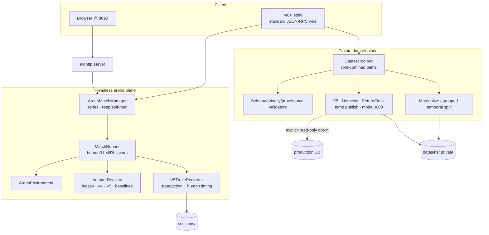

# RLHF Environment (`rlhf_env/`) — concise architecture overview

> Project-graph node for ExtraArena battle collection, private dataset
> administration and training orchestration. Full docs: `rlhf_env/DOCS.md`.
> Agent playbooks: `.codex/skills/extra-rlhf/` and its three sub-skills.

## Boundaries

The environment has two deliberately separate planes:

- **Headless arena** drives the deterministic
  `core.engine.ArenaEnvironment`, collects full V5 action/state traces, and
  writes only beneath `RLHF_SESSIONS_DIR`.
- **Private dataset toolbox** inventories, inspects, validates, exports,
  materializes and splits artifacts beneath `RLHF_DATASETS_DIR`. Local
  operations are always available. Read-only production V5/ReturnClock exports
  require explicit opt-in and never accept raw-player output or secret values
  as MCP arguments.

The browser arena runs at `127.0.0.1:8090`; MCP uses stdio. Production gameplay
remains independent. Production PostgreSQL is touched only by an explicitly
enabled read-only export process.

## Component graph



## Orchestration levels

| Level | Role | Scope |
|---|---|---|
| 0 | Pipeline orchestrator | collect → export → validate/split/materialize → offline train → eval → promote |
| 1 | Data-generation orchestrator | dispatch/monitor series, enforce structural and behavioral quality gates |
| 2 | Player sub-agent | own one complete start→play→finish lifecycle using compact indexed actions |

A live `match_id` is process-local. The worker that starts a human/LLM battle
must play it through the same persistent MCP process. RL-vs-RL auto-plays.

## Training contours

- **V5 policy:** terminal V5 bundles; only `accepted is True` rows become
  action targets. Deep validation covers action/state/terminal continuity,
  catalog hash/card count and degradation. Headless policy-ready groups can
  also source separately eligible Nemesis Lite records.
- **Metronome / TimeStamp:** independent production-label contours.
  Metronome requires observed uncensored human decision times aligned with
  pre-action states; TimeStamp requires real production battle-time labels.
  Headless CPU/wall-clock duration, LLM latency and synthetic delay are not
  substitutes. TimeStamp inputs are only prebattle deck(s),
  `starting_player`, and explicitly approved prebattle features.
  `duration_seconds`, `turns`, `finished_at`, and derivatives are
  labels/audit-only; passing the whole `timestamp_features` or `meta` object is
  forbidden target leakage.
- **Nemesis:** one record per terminal battle. `features.base` serves Lite;
  optional `features.extended` serves standard Nemesis. Eligibility,
  sample-weight and deck-pair split group travel with the same record.
- **ReturnClock:** cutoff-safe natural-return survival examples. Only
  `header.feature_columns` enter the estimator; `post_cutoff`,
  `user_id_hash` and `prediction_cutoff_at` are audit/split fields. The
  dedicated split is grouped by user, temporal, and organic-only. The raw
  export may retain treated intervals for audit, but trainer inputs come only
  from split rows with `post_cutoff.organic_candidate=true`.

ReturnClock data is pseudonymized, not anonymous. The HMAC salt stays in the
server environment; `RETURNCLOCK_DATASET_SALT_KEY_ID` records non-secret key
rotation. Natural-return forecasting is supported. A causal notification
send-time policy remains blocked until randomized no-send/control data exists.
Production collection is keyset-paged in one repeatable-read snapshot, with
pages up to 50,000 and a hard ceiling of 1,000,000 rows per raw stream.
Exclusive `end_at` is the event-time/censoring boundary; a later
`ingested_before` watermarks row creation. This keeps late-arriving
pre-boundary sessions and assignments without importing post-boundary event
times. The safety lag applies when `end` is omitted; an explicit historical
`end` is used as-is. A stream at the ceiling is incomplete and must not be
silently stitched with another censored export. Current export/split code
materializes the selected bounded window in memory, so size it against RAM.

## Key readiness rules

- For headless groups, require
  `validate_v5_traces.v5_policy_training_ready=true`,
  `training_ready_scope="v5_policy_only"` and zero degraded battles.
  `training_ready` is only a backward-compatible policy alias.
- Train Metronome or TimeStamp only when its own readiness field is true and
  observed production labels exist.
- Catalog/weights provenance must match the intended game/model.
- Rejected actions remain audit evidence, never training targets.
- `validate_training_export` must pass on the final artifact, not only source.
- Nemesis uses `split_nemesis_training_dataset`: Lite deck-grouped output is
  independently valid. Require `training_ready_standard=true` before using
  player-disjoint/chronological/deck-grouped Standard views; those require at
  least six players, three pairwise-disjoint human-human battles, three
  matchup groups and three cutoff cohorts. Player aliases never cross the
  player-disjoint partitions, and cross-partition battles are excluded and
  fingerprinted in the private manifest.
- ReturnClock uses the organic-only output of
  `split_returnclock_training_dataset`; never train from its mixed raw export
  or use a random row split.
- Every training run records checksum, format/version, validation summary,
  split/materialization manifest and relevant privacy/provenance identifiers.

Dataset handoffs use a new versioned path and `overwrite=false`. New artifacts
are assembled in a sibling temporary path and exposed by same-filesystem
rename. Overwrite can recover from ordinary caught errors, but it is not
crash-atomic across process or power failure and is not a promotion mechanism.

## Entry points

```bash
# Checkout-local dependency-bearing interpreter:
./rlhf_env/start_rlhf_env.sh setup --python /path/to/python3.13
PY=./rlhf_env/.venv/bin/python

./rlhf_env/start_rlhf_env.sh                    # web @ 8090
"$PY" -m rlhf_env.mcp_server \
  --sessions-dir rlhf_env/sessions \
  --datasets-dir datasets
```

Production export processes additionally require:

```bash
export RLHF_ENABLE_PRODUCTION_DATASETS=1
export RETURNCLOCK_DATASET_SALT='<export-specific secret, at least 32 bytes>'
export RETURNCLOCK_DATASET_SALT_KEY_ID='<non-secret rotation id>'
```

MCP registration and security details:
`.codex/skills/extra-rlhf/INSTALL.md`. On-disk contracts:
`.codex/skills/extra-rlhf/references/data-format.md`.
