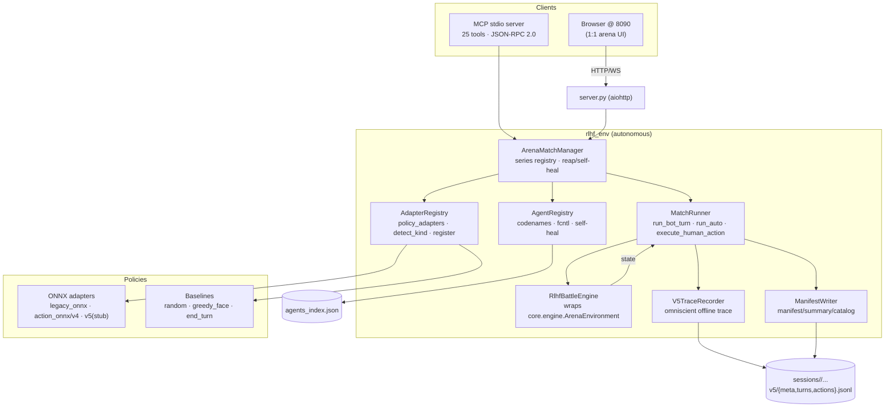

# RLHF Environment (`rlhf_env/`) — concise architecture overview

> Project-graph node for the autonomous RLHF data-collection + training-
> orchestration environment. Full docs: `rlhf_env/DOCS.md`. Skills (LLM
> orchestration playbooks): `.codex/skills/extra-rlhf/` (+ 3 sub-skills).

**What.** A standalone, files-only environment that drives the deterministic
ExtraArena engine (`core.engine.ArenaEnvironment`) **headless** to collect
per-turn, full-information training traces for imitation learning / RLHF. No
prod stack, no DB. Web arena on `127.0.0.1:8090`; MCP server on stdio. Lives
beside prod (8081) without touching it.

**Why separate.** Don't disturb prod; separate process/port; files > DB for
inspect/version/ship; MCP agents can run N battles, grab logs, swap models on
the fly; web UI is 1:1 with prod arena (same CSS classes).

## Component graph



## Three orchestration levels (LLM MCP users)

| Lvl | Role | Scope | Drives |
|---|---|---|---|
| 0 | Pipeline orchestrator | full train loop: collect → train → eval → promote | L1 + L2 |
| 1 | Data-gen orchestrator | plan/dispatch fleet of series, validate, ship dataset | L2 (for human/llm p1) |
| 2 | Player sub-agent | play ONE battle as p1 (human/llm) | player tools |

Composition: **L0 → L1 → many L2 in parallel**. Model-vs-model (`p1_actor_type="rl"`) auto-plays with no L2.

## Key concepts

- **Actor types** `p1_actor_type ∈ {human, llm, rl}` → `submit_action` for human/llm, `advance_bot` auto-play for rl. `decision_source ∈ {human, llm, bot, rl}`.
- **`battle_tag`** = `{p1}-vs-{bot|rl}` (p2 side: baseline→`bot`, real model→`rl`). Slices the dataset; `*-vs-rl` are the high-value traces.
- **Codenames** pin a series to a named sub-agent; auto-released on completion via self-healing reap (no mid-series release; recovers across process crashes).
- **`degraded`/`weights_hash`**: silent-fallback guard — `weights_hash=sha256(onnx)[:16]` proves which checkpoint actually played.

## Data flow (one battle)

```
start_series(spec) → ArenaMatchManager.create_series → MatchRunner
  loop: legal = engine.get_legal_actions(pid)
        action = policy.select_action (p2 / rl-p1) | submit_action (human/llm p1)
        engine.step(pid, legal[action]) → state_out
        V5TraceRecorder records (pre_state, action, post_state, decision_source)
        manifest.append_battle_result
  until is_ended → finalize (finished>=planned) → release codename
```

## On-disk layout

```
sessions/<group_id>/{manifest.json, summary.json, catalog.json,
                     battles/b_<bid>.json + .jsonl,
                     battles/<bid>/v5/{meta.json, turns.jsonl, actions.jsonl}}
sessions/agents_index.json
```
`actions.jsonl` is the **training-data surface** (omniscient, model-version-agnostic). See `rlhf_env/DOCS.md` §8 and `.codex/skills/extra-rlhf/references/data-format.md`.

## Entry points

- Web: `./rlhf_env/start_rlhf_env.sh` (port 8090)
- MCP: `./rlhf_env/start_rlhf_env.sh mcp`  /  `python3 -m rlhf_env.mcp_server`
- Setup: `./rlhf_env/start_rlhf_env.sh setup`
- Register MCP in Claude Code / Codex / OpenCode: `.codex/skills/extra-rlhf/INSTALL.md`

## Universal, not version-locked

"V5" is the **storage layout** name and the implemented 7128/601 + mana-draw
adapter kind. The same
orchestration serves legacy (`legacy_onnx`), action-conditioned (`action_onnx`/
`v4`), future adapters, and baselines. New kind → `register_custom_model` or
`AdapterRegistry.register(...)`.
