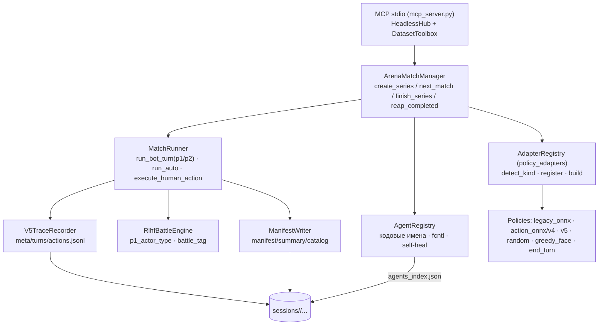

# RLHF-среда ExtraArena — Полная документация

> **Ревизия документации:** 2026-07-29
> **Зачем:** автономный headless-сбор боёв плюс приватный training-data toolbox
> для V5/Metronome/TimeStamp, Nemesis и ReturnClock.
> **0.3:** compact/indexed LLM player, реализованный V5 adapter, глубокие
> catalog/degraded/accepted gates, standard MCP wire, root-confined
> export/inspect/validate/materialize/split с opt-in read-only production
> plane. LLM playbooks: `.codex/skills/extra-rlhf/`. Краткий обзор:
> `docs/RLHF_ENV.md`.

---

## Содержание

1. [Контекст и мотивация](#1-контекст-и-мотивация)
2. [Архитектура](#2-архитектура)
3. [Установка и запуск](#3-установка-и-запуск)
4. [Web-интерфейс](#4-web-интерфейс)
5. [REST API](#5-rest-api)
6. [WebSocket-протокол](#6-websocket-протокол)
7. [MCP-сервер и оркестрация](#7-mcp-сервер-и-оркестрация)
8. [Формат данных на диске](#8-формат-данных-на-диске)
9. [Добавление собственных моделей](#9-добавление-собственных-моделей)
10. [CLI-лаунчер start_rlhf_env.sh](#10-cli-лаунчер-start_rlhf_envsh)
11. [Программный API (Python)](#11-программный-api-python)
12. [Тестирование](#12-тестирование)
13. [Troubleshooting](#13-troubleshooting)
14. [Расширение среды](#14-расширение-среды)

---

## 1. Контекст и мотивация

### 1.1. Проблема

Боты Extra-LR-V4 / V4-Max обучены на синтетике / self-play. Чтобы поднять
V5 и далее, нужны **реальные игровые траектории**: человек играет против
модели, и каждый ход + состояние + метаданные записываются для последующего
imitation learning или RLHF.

### 1.2. Почему отдельная среда

- **Headless не задевает прод.** БД, бот, прод-веб остаются отдельными.
- **Отдельный порт** (8090) и процесс — можно запустить/остановить когда угодно.
- **Файлы для training artifacts** — проще инспектировать, валидировать,
  версионировать и передавать тренеру.
- **MCP-агентам** удобно: запустить N боёв, забрать логи, поменять модель «на лету».
- **Web 1:1 как прод** — те же CSS-классы `.arena-*`, `.board-slot`, `.hand-card`, `.hp-*`.

### 1.3. Что внутри

| Компонент | Назначение |
|-----------|-----------|
| `server.py` | aiohttp app: HTTP + WebSocket (web-арена @ 8090) |
| `mcp_server.py` | MCP stdio (JSON-RPC 2.0), `HeadlessHub` + private dataset toolbox |
| `components/dataset_toolbox.py` | Root-confined inventory, inspect, deep validate, V5/Nemesis/ReturnClock export/materialize/split |
| `components/arena_match_manager.py` | Реестр серий: `create_series`/`next_match`/`finish_series`/`reap_completed` (self-heal) |
| `components/match_runner.py` | Один матч: `run_bot_turn`/`run_auto`/`execute_human_action`; p1-as-RL auto-play; `_capture_models` |
| `components/arena_engine.py` | `RlhfBattleEngine` — обёртка над `core.engine`, `p1_actor_type`, `battle_tag` |
| `components/agent_registry.py` | Кодовые имена суб-агентов; `fcntl.flock` cross-process + `_self_heal_locked` |
| `components/policy_adapters.py` | `AdapterRegistry` — legacy/V4/V5/baselines, extension via `register`/`register_detector` |
| `components/policy_registry.py` | Сканирует `ai/models/*.onnx` + sidecar; `resolve_spec` (вкл. custom by path) |
| `components/policy_factory.py` | `build_policy(spec)` → делегирует `AdapterRegistry` |
| `components/v5_trace.py` | `V5TraceRecorder` — omniscient offline-трейс (`v5/{meta,turns,actions}.jsonl`) |
| `components/manifest.py` | Manifest + summary + catalog JSON; auto-finalize на `finished>=planned` |
| `components/deck_builder.py` | Случайная арена-дека + custom + preset |
| `components/log_schema.py` | Схема battle_log v1.0 |
| `components/inference_params.py` | Defaults от sidecar |
| `index.html` + `static/rlhf.js` | Форма старта серии (POST /api/groups → redirect_url → 1:1 `/arena`) |
| `webapp_borrow/` (arena.html/arena.js/arena-styles.css/safe-area.js) | Verbatim 1:1 арена из `webapp/` |

---

## 2. Архитектура

### 2.1. Слои

```
┌──────────────────────────────────────────────────────────────┐
│                       Browser @ 8090                          │
│   (1:1 CSS, WebSocket к /ws/groups/.../battles/...)            │
└──────────────────────────────────────────────────────────────┘
                            │ HTTP / WS
                            ▼
┌──────────────────────────────────────────────────────────────┐
│                  aiohttp server.py                            │
│   /health /api/registry/* /api/groups/* /ws/groups/...        │
└──────────────────────────────────────────────────────────────┘
                            │
                            ▼
┌──────────────────────────────────────────────────────────────┐
│                SessionManager                                 │
│   asyncio.create_task(_run_group(state)) per group             │
│   tracks GroupState (status, task, manifest_writer)            │
└──────────────────────────────────────────────────────────────┘
                            │
                            ▼
┌──────────────────────────────────────────────────────────────┐
│            BattleRunner per battle                             │
│   engine.step(legal[policy.get_action(state, pid, legal)])     │
│   writes battle_log.json + append_battle_result(manifest)      │
└──────────────────────────────────────────────────────────────┘
                            │
                            ▼
┌──────────────────────────────────────────────────────────────┐
│      core.engine.ArenaEnvironment                             │
│   deterministic, pure (state_in, action) → (state_out, ok)    │
└──────────────────────────────────────────────────────────────┘
                            │
                            ▼
┌──────────────────────────────────────────────────────────────┐
│   ai.bot_brain.BerserkInference  или  baselines               │
│   V3 (legacy ONNX)  /  V4 (action-conditioned) / random …    │
└──────────────────────────────────────────────────────────────┘
```

### 2.1b. Headless / MCP-поток (оркестрация, model-vs-model, semi-synthetic)

Web-путь выше — для браузера. Оркестрация (MCP + model-vs-model) идёт через
`ArenaMatchManager` + `MatchRunner` headless, без WS/браузера:



`p1_actor_type ∈ {human, llm, rl}`: human/llm — p1 управляется через
`submit_action` (MCP player-path или WS); `rl` — p1 auto-играет через
`run_bot_turn(player_id=p1, policy=match.p1_policy)` (model-vs-model, без
`submit_action`). `battle_tag = {p1}-vs-{bot|rl}` зависит только от kind-а p2.

Для браузерного `p1_actor_type=human` каждая action-row также несёт
`human_decision_time_ms`: наблюдаемую сервером паузу от выдачи человеку
управляемого state до следующего action request. Для `llm|rl|bot` поле
всегда `null`.

### 2.2. Поток данных (один бой)

```
loop:
  1. legal = engine.get_legal_actions(pid)
  2. if pid == human: ждём WS-сообщение {index: N}
     else: action_idx = policy.get_action(state, pid, legal, params)
  3. ok, err = engine.step(pid, legal[action_idx])
  4. log.append({turn, actor, action, state_before, state_after, ts_ms})
  5. if pid == human: broadcast state via WS
  6. check victory / max_turns → break
end loop
write battle_log.json
manifest.append_battle_result(...)
```

### 2.3. Поток данных (группа)

```
Browser "Запустить N боёв" → POST /api/groups {p1, p2, count, deck, seed, …}
   ↓
session_manager.start(spec)
   ├─ group_id = uuid4().hex[:12]
   ├─ ManifestWriter(group_id, spec, group_dir)  → manifest.json сразу
   └─ for i in 1..N:
         BattleRunner(...).arun()
         manifest.append_battle_result(...)
   └─ manifest.finalize()  → summary.json + finished_at
```

### 2.4. State на диске

```
rlhf_env/sessions/<group_id>/
├── manifest.json        ← группа: spec, env, results, battle_ids, battles_results
├── summary.json         ← финальный winrate + агрегаты
└── battles/
    ├── <battle_id_1>.json  ← полный battle_log (1.0)
    ├── <battle_id_2>.json
    └── ...
```

---

## 3. Установка и запуск

### 3.1. Зависимости

`rlhf_env/requirements.txt`:
```
aiohttp>=3.9.0
python-socketio>=5.11.0
numpy>=1.24.0
onnxruntime>=1.17.0
mcp>=1.0.0
asyncpg>=0.30.0
python-dotenv>=1.0.0
```

### 3.2. Запуск через `start_rlhf_env.sh`

```bash
./rlhf_env/start_rlhf_env.sh                       # web @ 127.0.0.1:8090
./rlhf_env/start_rlhf_env.sh --port 9000           # другой порт
./rlhf_env/start_rlhf_env.sh --host 0.0.0.0        # доступ снаружи
./rlhf_env/start_rlhf_env.sh --models-dir /path    # другая папка моделей
./rlhf_env/start_rlhf_env.sh --sessions-dir /path  # другая папка сессий
./rlhf_env/start_rlhf_env.sh mcp                   # MCP stdio
./rlhf_env/start_rlhf_env.sh setup --python /path/to/python3.13
./rlhf_env/start_rlhf_env.sh --no-venv             # использовать системный Python
```

Что делает скрипт:
1. Создаёт `rlhf_env/.venv` если нет.
2. Ставит deps из `requirements.txt`.
3. Проверяет, что порт свободен.
4. Стартует `python -m rlhf_env.server` (или `mcp_server`).

### 3.3. Запуск вручную

```bash
PY=./rlhf_env/.venv/bin/python
"$PY" -m rlhf_env.server --port 8090
"$PY" -m rlhf_env.mcp_server --datasets-dir datasets
```

Env-vars (читаются `server.py`):
- `RLHF_HOST` (default `127.0.0.1`)
- `RLHF_PORT` (default `8090`)
- `RLHF_MODELS_DIR` (default `ai/models`)
- `RLHF_SESSIONS_DIR` (default `rlhf_env/sessions`)
- `RLHF_DATASETS_DIR` (MCP default `datasets`)
- `RLHF_CARDS_PATH` (default `ai/cards.json`)
- `RLHF_ENABLE_PRODUCTION_DATASETS` (default false)
- `RLHF_RETURNCLOCK_SALT_ENV` (имя env с salt; default
  `RETURNCLOCK_DATASET_SALT`)
- `RLHF_RETURNCLOCK_SALT_KEY_ID_ENV` (имя env с non-secret key id; default
  `RETURNCLOCK_DATASET_SALT_KEY_ID`)

### 3.4. Что НЕ требуется

- Не нужен запущенный прод-сервер.
- Не нужна БД.
- Не нужны права админа.

---

## 4. Web-интерфейс

### 4.1. Главная страница (`/`)

Форма «Новая группа боёв»:
- **p1_model** / **p2_model** — выбор модели (dropdown из registry).
- **deck_strategy** — `random_arenaenv` или `custom_json`.
- **custom_deck_p1** / **custom_deck_p2** — JSON-список `[hero, *warriors, *potions]`.
- **battles_planned** — количество боёв.
- **max_turns** — лимит ходов на бой (default 60).
- **seed** — для воспроизводимости.
- **starting_player** — `random` / `p1` / `p2`.

После нажатия «Запустить» — редирект на `/groups/<gid>`.

### 4.2. Страница группы (`/groups/<gid>`)

- Статус (running / completed / error).
- Прогресс-бар по боям.
- Winrate p1 / p2.
- Таблица battle_id → ссылка на `/groups/<gid>/battles/<bid>`.

### 4.3. Страница боя (`/groups/<gid>/battles/<bid>`)

- 1:1 рендер арены (verbatim `arena.html` + `arena.js` из `webapp_borrow/`).
- Кнопки «Закончить ход», «Сыграть карту», «Атаковать».
- WebSocket (Socket.IO) для human-vs-model; HTTP `/api/battle/*` для действий.

---

## 5. REST API

### 5.1. `GET /health`

```json
{"status": "ok", "models_loaded": 7, "rlhf_env_version": "0.1.0"}
```

### 5.2. `GET /api/registry/models`

Возвращает список всех моделей, найденных в `ai/models/*.onnx` + sidecar.

```json
{
  "models": [
    {
      "name": "extra-lr-v4-max",
      "kind": "action_onnx",
      "policy_file": "ai/models/extra-lr-v4-max.onnx",
      "sidecar_file": "ai/models/extra-lr-v4-max.onnx.json",
      "inference": {"mode": "argmax", "temperature": 0.0, ...}
    },
    {"name": "random", "kind": "random", ...},
    {"name": "end_turn", "kind": "end_turn", ...}
  ]
}
```

### 5.3. `GET /api/registry/sample-deck`

```json
{
  "deck": [1, 42, 14, 39, 27, 14, 44, 24, 44, 33, 24, 33, 39, 42, 27, 8, 8, 13, 13, 10, 10],
  "size": 21
}
```

### 5.4. `POST /api/groups`

Запустить группу.

```json
{
  "p1_model": "extra-lr-v4-max",
  "p2_model": "end_turn",
  "deck_strategy": "random_arenaenv",
  "battles_planned": 5,
  "seed": 42,
  "starting_player": "random",
  "max_turns": 40
}
```

Ответ:
```json
{"group_id": "a3b8c1d2e4f5", "status": "running"}
```

### 5.5. `GET /api/groups`

Список всех групп (running + completed/loaded с диска).

### 5.6. `GET /api/groups/{gid}`

```json
{
  "group_id": "a3b8c1d2e4f5",
  "status": "completed",
  "started_at": "2026-06-24T12:00:00Z",
  "finished_at": "2026-06-24T12:05:00Z",
  "battles_planned": 5,
  "battles_finished": 5,
  "winrate_p1": 0.6,
  "winrate_p2": 0.4,
  "last_error": null
}
```

### 5.7. `GET /api/groups/{gid}/manifest`

Полный manifest.json (включая spec, env, results, battles_results, battle_ids).

### 5.8. `GET /api/groups/{gid}/battles`

```json
{"battle_ids": ["...", "...", "..."]}
```

### 5.9. `GET /api/groups/{gid}/battles/{bid}`

Полный battle_log.json.

### 5.10. `POST /api/groups/{gid}/stop`

Остановить running группу. Если группа уже completed — возвращает 404.

---

## 6. WebSocket-протокол

### 6.1. Endpoint

`ws://127.0.0.1:8090/ws/groups/{gid}/battles/{bid}`

### 6.2. Сообщения клиент → сервер

```json
{"type": "action", "index": 3}        // выбрать legal[3]
{"type": "ready"}                     // готов начать / продолжить
```

### 6.3. Сообщения сервер → клиент

```json
{"type": "state", "view": {...state_view...}}
{"type": "legal_actions", "actions": [{...}, ...]}
{"type": "ended", "result": {"status": "P1_WIN", "winner_user_id": 1000}}
{"type": "error", "message": "..."}
```

### 6.4. Пример

```js
const ws = new WebSocket("ws://127.0.0.1:8090/ws/groups/.../battles/...");
ws.onopen = () => ws.send(JSON.stringify({type: "ready"}));
ws.onmessage = (e) => {
  const msg = JSON.parse(e.data);
  if (msg.type === "legal_actions") renderActions(msg.actions);
  if (msg.type === "state") renderBoard(msg.view);
  if (msg.type === "ended") showResult(msg.result);
};
```

---

## 7. MCP-сервер и оркестрация

MCP-сервер — stdio JSON-RPC 2.0 (`rlhf_env/mcp_server.py`, transport `HeadlessHub`).
Открывает headless series/player/trace инструменты и приватный dataset toolbox
для V5, Nemesis и ReturnClock. Подключается к Claude Code / Codex / OpenCode
(см. §7.7 и `.codex/skills/extra-rlhf/INSTALL.md`).

`tools/call` отвечает стандартным MCP payload: JSON text в
`content[0].text`, тот же объект в `structuredContent`, `isError` для статуса.
Клиентам следует читать `structuredContent`, если он доступен.

### 7.1. Запуск

```bash
./rlhf_env/start_rlhf_env.sh mcp
# или напрямую (ОБЯЗАТЕЛЬНО из корня репо — иначе не резолвится пакет rlhf_env
# и относительные пути ai/models, ai/cards.json):
./rlhf_env/.venv/bin/python \
  -m rlhf_env.mcp_server \
  --models-dir ai/models \
  --sessions-dir rlhf_env/sessions \
  --datasets-dir datasets \
  --cards-path ai/cards.json
```

CLI-флаги дублируются env-переменными: `RLHF_MODELS_DIR`, `RLHF_SESSIONS_DIR`,
`RLHF_DATASETS_DIR`, `RLHF_CARDS_PATH`, `RLHF_LOG_LEVEL`. Нужно пинить
checkout-local dependency-bearing interpreter: bare `python3` может быть без
NumPy/ONNX Runtime. Логи идут в stderr (stdout — только JSON-RPC).

### 7.2. Инструменты

**Жизненный цикл серии (data-gen)**

| Tool | Аргументы | Возврат |
|------|-----------|---------|
| `start_series` | `spec: dict` (см. §7.3) | `{group_id, match_id, battle_id, battles_planned, opponent, agent_name, p1_model, p2_model, battle_tag}` |
| `next_battle` | `group_id: str` | `{match_id, battle_id}` \| `{status:"series_complete"}` |
| `finish_series` | `group_id: str` | полное `manifest.json` (закрывает серию, освобождает кодовое имя) |
| `list_battle_groups` | — | `{groups:[{group_id, agent_name, battles_finished, battles_planned, p1_wins, p2_wins, draws, p1_actor_type, p2_model, battle_tag}]}` |
| `get_battle_group_status` | `group_id: str` | статус группы (progress, wins/losses, decks, opponent) |
| `get_battle_group_manifest` | `group_id: str` | полное `manifest.json` |
| `list_battle_manifests` | `group_id: str` | `{battles:[...]}` |
| `download_battle_logs` | `group_id, format="json"\|"zip"` | `{path, size}` |
| `list_models` | — | `{models:[{name, kind, path, weights_hash, degraded}]}` |
| `register_custom_model` | `{name, path, kind?}` | `{registered, kind, detected_kind}` — in-memory spec в `PolicyRegistry` (модель по path+adapter без копирования) |

**Player (субагент-игрок, p1 = human/llm)**

| Tool | Аргументы | Возврат |
|------|-----------|---------|
| `get_state` | `match_id, compact?, history_limit?` | actor-perspective state; compact сохраняет decision fields и полный indexed legal set |
| `get_legal_actions` | `match_id: str` | `{legal_actions:[{legal_action_index,...}], is_my_turn}` |
| `submit_action` | `match_id, legal_action_index` (preferred) или `action`, `compact_response?`, `history_limit?` | `{result, state, sound_events}`; при rl-p1 отвергается |
| `advance_bot` | `match_id: str` | `{status, is_ended}` — шаг авто-игрока (p2 всегда; p1 тоже, если rl) |
| `surrender` | `match_id: str` | `{result:{game_over, winner_id}, state}` (**отвергается при `p1_actor_type=="rl"`**) |
| `get_match_status` | `match_id: str` | lightweight `{turn, is_ended, winner, is_my_turn, current_player_id, action_count}` (без полного state — для polling) |
| `get_action_history` | `match_id, limit?` | `{actions:[{turn, actor, kind, action_dict, ok}], count}` (replay длинных боёв без re-fetch fullstate) |

**Датасет + V5-trace (V5 training orchestrator)**

| Tool | Аргументы | Возврат |
|------|-----------|---------|
| `get_dataset` | `group_id: str` | `{dataset_jsonl, dataset_rows, per_battle_jsonl}` |
| `get_v5_dataset_summary` | `group_id: str` | accepted/rejected counts, catalog provenance, degraded battles, tag/actions/turns, behavioral quality и readiness по контурам |
| `list_v5_groups` | `battle_tag?, limit?` | группы + pooled quality по выборке |
| `get_v5_trace` | `group_id, battle_id, what, offset?, limit?` | bounded/paginated trace |
| `validate_v5_traces` | `group_id: str` | deep integrity + degraded/catalog/card-count gate; `v5_policy_training_ready`, отдельные Metronome/TimeStamp readiness и backward-compatible `training_ready` |

**Оркестрация флотом (агенты/серии)**

| Tool | Аргументы | Возврат |
|------|-----------|---------|
| `list_active_series` | — | `{count, agents:[{agent_name, group_id, battles N/M, wins, losses, draws, opponent_model, p1_actor_type}], by_model:[{model, groups, wins, losses}]}` |
| `get_agent_status` | `agent_name: str` | `{agent_name, busy, group_id, current_match_id, battles_finished, battles_planned, wins, losses, draws, decks:{p1,p2}, opponent_model, p1_actor_type}` |
| `list_preset_decks` | — | `{presets:[{preset_number, preset_name, card_ids, is_playable}]}` (без БД → `[]` + note) |

**Private training-data toolbox**

| Tool | Назначение |
|------|------------|
| `get_training_data_status` | datasets root, inventory, production/salt readiness, headless counts, causal blocker |
| `list_training_exports` | bounded inventory по kind |
| `inspect_training_export` | checksum/mode/header/manifest без строк датасета |
| `validate_training_export` | schema/privacy/count/provenance/split readiness |
| `export_v5_training_dataset` | opt-in read-only terminal production V5 export, side pseudonyms |
| `materialize_v5_training_dataset` | transport → canonical `rlhf_v5_storage_v1`; fresh-path temp build + rename after deep validation |
| `export_nemesis_training_dataset` | V5 transport `input_path` или completed headless `group_id` → одна terminal battle row: Lite base + optional standard extension |
| `split_nemesis_training_dataset` | всегда Lite deck-grouped; при прохождении Standard gates — player-disjoint / chronological / deck-grouped; Lite-only handoff остаётся готовым, player aliases только для группировки |
| `export_returnclock_training_dataset` | cutoff-safe audit/survival export; keyset-paged repeatable-read snapshot, HMAC salt only from env |
| `split_returnclock_training_dataset` | organic-only grouped-by-user temporal train/validation/test + leakage gate |

### 7.3. `start_series` — анатомия spec

```jsonc
{
  "p2_model": "extra-lr-v4-max",          // имя из registry ИЛИ baseline
  // альтернатива — модель по path+adapter (без registry):
  "p2_model_path": "ai/models/my.onnx",
  "p2_model_kind": "auto",                 // auto|action_onnx|legacy_onnx|v5|random|greedy_face|end_turn
  // или nested-объект:
  // "p2_model": {"name":"my","path":"...","kind":"action_onnx"},

  "p1_actor_type": "llm",                 // human|llm|rl  (default llm)
  "p1_model": "random",                   // только для rl (p1 auto-play, model-vs-model)
  "p1_model_path": "...", "p1_model_kind": "auto",

  "agent_name": "veceno",                 // опц; иначе auto-assign из пула кодовых имён
  "battles_planned": 10,
  "seed": 42,
  "starting_player": "p1",                // p1|p2|random
  "max_turns": 60,

  "deck_strategy_p1": "random_arenaenv",  // random_arenaenv|custom|preset
  "deck_strategy_p2": "random_arenaenv",
  "preset_name_p1": "...", "preset_number_p1": 3,
  "custom_deck_p1": [...],
  "custom_deck_p2": [...]
}
```

`required: []` — валидируется по сочетанию полей (минимум какой-то opponent).

### 7.4. Actor types и battle_tag

`p1_actor_type ∈ {human, llm, rl}`:

- **human / llm** — p1 управляется через `submit_action` (MCP-субагент-игрок или
  браузер). `advance_bot` двигает только p2.
- **rl** — p1 auto-играет своей RL-моделью (`p1_model`); `submit_action`/`surrender`
  отвергаются; `advance_bot` двигает обе стороны по очереди (model-vs-model, без
  MCP-клиента).

`decision_source ∈ {human, llm, bot, rl}` — кто принял решение в данном ходу,
попадает в `actions.jsonl` (V5-trace).

`battle_tag = "{p1}-vs-{bot|rl}"` — **зависит только от стороны p2**: baseline
(random/greedy_face/end_turn) → `bot`, настоящая модель → `rl`. Примеры:
`human-vs-bot`, `llm-vs-rl`, `rl-vs-bot`, `rl-vs-rl`. Тег режет датасет;
`*-vs-rl` — высокоценные следы против сильного оппонента.

### 7.5. Кодовые имена агентов + reap/self-heal

Серия пинится за «играющим» субагентом с кодовым именем (`agent_name`). Если имя
не задано — `AgentRegistry.claim_auto()` выбирает из пула:
(1) fixed `["Veceno","Mentalist","Pvwell","Sinaf","Movi","Ilya","Oguzok","Milita",
"dranik","sukunyata","absolute"]`;
(2) имена карт из `ai/cards.json`;
(3) random-fallback `Agent-<hex>` при исчерпании.

Состояние persist в `sessions/agents_index.json` (atomic tmp+rename,
`fcntl.flock`). Явный `finish_series` освобождает имя. Read-path self-healing
reap (`get_match_status`, `get_agent_status`, `list_active_series`) освобождает
его только когда текущий бой terminal **и**
`battles_finished >= battles_planned`; mid-series release запрещён.

### 7.6. V5-trace и integrity

V5-trace (`V5TraceRecorder`) — **omniscient** offline-only след боя: знает обе
руки/борды/колоды (не только perspective p1). На диск:
`sessions/<group>/battles/<bid>/v5/{meta.json, turns.jsonl, actions.jsonl}`.
`actions.jsonl` — поверхность тренировочных данных (model-version-agnostic).
`weights_hash=sha256(onnx)[:16]` + флаг `degraded` доказывают, какой чекпоинт
реально играл (silent-fallback guard). В action targets допускаются только
строки `accepted is True`; отклонённые действия сохраняются для аудита.
`human_decision_time_ms` заполняется только для human и aligned с
соответствующим pre-action state для Metronome. CPU/wall-clock длительность
headless engine, LLM latency и искусственная задержка не считаются human
labels.

**Глубокая integrity-проверка** (`validate_v5_traces` →
`rlhf_env/components/v5_trace_validate.py:validate_v5_trace`) — не только
наличие/непустота `meta`/`turns`/`actions`, а строгие инварианты обучающих
данных (универсальны, без привязки к `classic_*` кодекам / tcode):

1. **legal_action_index** — индекс валиден в `legal_actions` (`0..N-1`);
   `action_native == legal_actions[idx]` (метка указывает ровно на сыгранное
   действие); `legal_action_count == len(legal_actions)`; `None` на
   `accepted`-действии = потеря обучающей метки (`[legal_index]`).
2. **actor / decision_source** — `actor_player ⇔ actor_user_id ⇔ meta
   user_id`; `decision_source` согласован с `meta.{p1,p2}_actor_type` (p2 всегда
   `bot`); `pre_state.current_turn_owner_id == actor_user_id` (`[actor]`).
3. **continuity** — `post_state[N] == pre_state[N+1]` (цепочка состояния без
   потерь); `seq` континуален `1..N`; `pre_state`/`post_state` не None;
   терминальный статус согласован с `meta.status`/`winner_user_id` (для
   терминальной `surrender`-строки `state.status` не сравнивается —
   `mark_surrender` не мутирует его, авторитет `meta.status`; draw/stalemate
   не имеют победителя); `turns.jsonl` ↦ `actions.jsonl` на границе хода
   (`[continuity]`).
4. **correspondence** — `battle_log` `b_<bid>.json` `actions` 1:1 (по порядку)
   совпадают с не-терминальными trace-строками по
   `actor`/`action_type`/`action_json`/`accepted`/`turn(post)`; терминальные
   `surrender`-строки (нет battle_log-записи) исключаются из подсчёта
   (`[correspondence]`).
5. **provenance** — `meta.catalog_hash` совпадает с текущим каталогом,
   catalog file безопасен и имеет ожидаемое число карт; degraded/policy
   warnings делают группу неготовой к обучению.

`issues` — тегированные строки `[legal_index|actor|continuity|correspondence]
...`. Покрыто тестами `rlhf_env/tests/test_v5_trace_validate.py` (реальный бой
проходит; мутации каждого класса флагаются).

### 7.7. Три уровня оркестрации (LLM MCP-юзеры)

| Lvl | Роль | Скоуп | Драйвит |
|---|---|---|---|
| 0 | Pipeline-оркестратор | полный train-цикл: collect → train → eval → promote | L1 + L2 |
| 1 | Data-gen оркестратор | план/диспетч флота серий, валидация, шип датасета | L2 (для human/llm p1) |
| 2 | Player-субагент | играет ОДИН бой как p1 (human/llm) | player-tools |

Композиция: **L0 → L1 → много L2 параллельно**. Каждый L2 владеет полным
start→play→finish lifecycle в одном persistent MCP process: live `match_id`
process-local и не переносится между stdio-серверами. Model-vs-model
(`p1_actor_type=rl`) auto-играет без L2. Playbook'и:
`.codex/skills/extra-rlhf/` (umbrella) +
`extrarlhf-pipeline-orchestration` (L0) + `extrarlhf-gen-orchestration` (L1) +
`extrarlhf-player` (L2). Универсальны, не привязаны к V5 (см. §14.1, §14.4).

### 7.8. Training-ready dataset workflow

Dataset paths confined to `--datasets-dir`: `..`, symlink escape и внешний
absolute path отвергаются. Local inventory/inspect/validate/materialize/split
доступны по умолчанию. Production reads включаются только в trusted process:

```bash
export RLHF_ENABLE_PRODUCTION_DATASETS=1
export RETURNCLOCK_DATASET_SALT='<export-specific secret, at least 32 bytes>'
export RETURNCLOCK_DATASET_SALT_KEY_ID='<non-secret rotation id>'
```

Salt value, DSN и raw-player export switch не являются MCP arguments.
ReturnClock output псевдонимизирован, не анонимен, и остаётся в закрытом
training storage. `RETURNCLOCK_DATASET_SALT_KEY_ID` нужен для аудита ротаций;
объединять user groups из разных key id без явного mapping нельзя.

Общий flow:

1. `get_training_data_status`.
2. Export в новый versioned путь (`overwrite=false`).
3. `inspect_training_export` и `validate_training_export`; требовать `ok` и
   readiness именно обучаемого контура.
4. V5: materialize и повторно validate directory. Nemesis:
   `split_nemesis_training_dataset`; Lite deck-grouped публикуется всегда, а
   Standard player-disjoint/chronological/deck-grouped assignments — только
   при `training_ready_standard=true`. Cross-partition player battles
   исключаются и учитываются в manifest. ReturnClock: dedicated
   grouped-temporal split и leakage gate.
5. Сохранить SHA-256, format/version, validation summary,
   split/materialization manifest, catalog/weights provenance, exclusion
   counts/sample weights и privacy key id.

**V5 policy.** В action targets идут только строки `accepted is True`;
rejected rows остаются audit evidence. Нужны текущий catalog hash/card count,
правильный `weights_hash`, zero degraded и state/action/terminal continuity.
Для headless групп требовать `v5_policy_training_ready=true` и
`training_ready_scope="v5_policy_only"`; общий `training_ready` — только
backward-compatible alias policy gate. Такой group допустим и как источник
отдельно eligible Nemesis Lite rows.

**Metronome / TimeStamp.** Это независимые readiness gates. Metronome требует
observed uncensored human decision-time labels, aligned с pre-action state.
TimeStamp требует реальные production battle-time labels. При отсутствии
таких наблюдений соответствующий readiness остаётся false, даже если V5 policy
ready. Headless CPU/wall-clock duration, LLM latency и synthetic delay не
заменяют human labels. TimeStamp inputs строятся только из prebattle колоды или
пары колод, `starting_player` и явно разрешённых признаков, существовавших до
начала боя. `duration_seconds`, `turns`, `finished_at` и производные являются
только labels/audit. Loader, передающий весь `timestamp_features` или `meta`,
должен fail closed как target-leakage defect.

**Nemesis.** Одна строка на terminal battle содержит `features.base` для Lite и
optional `features.extended` для standard. Использовать
`eligible_lite`/`eligible_standard`, `sample_weight`, exclusion reasons и
deck-pair split group. Human-vs-bot и model-vs-model обучают Lite; masked
human-bot extension сохраняется только для аудита/будущего domain-aware
research и не входит в текущий canonical Standard trainer. Source export
намеренно не объявляет Standard training-ready до
`split_nemesis_training_dataset`. Split bundle всегда содержит Lite
deck-grouped, а Standard player-disjoint primary + chronological/deck-grouped
evaluation добавляются только при наличии минимум шести игроков, трёх
pairwise-disjoint human-human боёв, трёх matchup groups и трёх cutoff cohorts.
Player aliases назначаются ровно
одному partition, cross-partition battles исключаются и fingerprint-ятся;
aliases остаются вне `features`.

**ReturnClock.** Estimator получает только `header.feature_columns`.
`post_cutoff`, `user_id_hash`, `prediction_cutoff_at` запрещены как features.
Raw export может сохранять treated intervals для аудита, но training split
строго grouped by user, temporal и organic-only: каждая train/eval строка имеет
`post_cutoff.organic_candidate=true`, а manifest содержит `training_filter` и
число исключённых treated rows. Natural-return trainer не читает mixed raw
export. Causal send-time policy блокирован до randomized no-send/control pilot.

Production snapshot читается keyset pagination внутри одной repeatable-read
transaction: страницы до 50,000, максимум 1,000,000 строк на каждый raw stream.
Exclusive `end_at` ограничивает event time/censoring. Более поздний
`ingested_before` отдельно ограничивает `created_at` session, decision и
delivery rows, поэтому late status/update не выбрасывает старый assignment и
не меняет treated interval на organic. Safety lag защищает границу только когда
`end` не задан; explicit historical `end` используется без сдвига. Если stream
достиг ceiling, export считается неполным: нельзя молча склеивать независимо
цензурированные выгрузки. Exporter и splitter сейчас материализуют выбранное
окно в памяти, поэтому крупные окна нужно подбирать с учётом доступной RAM.

Fresh destination собирается рядом во временном пути и публикуется
same-filesystem rename. Overwrite имеет rollback для обычных перехваченных
ошибок, но не гарантирует crash-atomic replacement при `SIGKILL`/power loss.
Поэтому promotion выполняется новым versioned path с `overwrite=false` и
внешним pointer после validation.

### 7.9. Пример (curl-style через stdin)

```bash
PY=./rlhf_env/.venv/bin/python

# 1. server жив + tools enumerate
echo '{"jsonrpc":"2.0","id":1,"method":"tools/list"}' \
  | "$PY" -m rlhf_env.mcp_server

# 2. llm-vs-bot серия: 3 боя против V4-max, авто-кодовое имя
echo '{
  "jsonrpc":"2.0","id":2,"method":"tools/call",
  "params":{"name":"start_series",
            "arguments":{"spec":{"p2_model":"extra-lr-v4-max","battles_planned":3,
                                 "seed":42,"starting_player":"p1"}}}
}' | "$PY" -m rlhf_env.mcp_server

# 3. model-vs-model: наша RL p1 auto-играет, тег rl-vs-rl
echo '{
  "jsonrpc":"2.0","id":3,"method":"tools/call",
  "params":{"name":"start_series",
            "arguments":{"spec":{"p1_actor_type":"rl","p1_model":"extra-lr-v3-max",
                                 "p2_model":"extra-lr-v4-max","battles_planned":3,"seed":7}}}
}' | "$PY" -m rlhf_env.mcp_server

# 4. статус агента
echo '{"jsonrpc":"2.0","id":4,"method":"tools/call",
       "params":{"name":"get_agent_status","arguments":{"agent_name":"veceno"}}}' \
  | "$PY" -m rlhf_env.mcp_server
```

---

## 8. Формат данных на диске

### 8.1. manifest.json

```json
{
  "manifest_version": "1.0",
  "group_id": "a3b8c1d2e4f5",
  "agent_name": "veceno",
  "created_at": "2026-06-24T12:00:00Z",
  "finished_at": "2026-06-24T12:05:00Z",
  "spec": {
    "p1_actor_type": "llm",
    "p1_model": null,
    "p2_model": "extra-lr-v4-max",
    "battle_tag": "llm-vs-rl",
    "deck_strategy": "random_arenaenv",
    "custom_decks": null,
    "battles_planned": 5,
    "seed": 42,
    "starting_player": "random",
    "max_turns": 60
  },
  "env": {
    "rlhf_env_version": "0.1.0",
    "core_engine_commit": "a012cac1",
    "python_version": "3.11.5",
    "platform": "macOS-26.5-arm64",
    "onnxruntime_version": "1.22.1",
    "numpy_version": "2.3.2",
    "aiohttp_version": "3.9.1"
  },
  "results": {
    "battles_finished": 5,
    "battles_planned": 5,
    "p1_wins": 3, "p2_wins": 1, "draws": 1,
    "winrate_p1": 0.6, "winrate_p2": 0.2,
    "avg_turns": 12.3, "avg_duration_seconds": 0.42
  },
  "battle_ids": ["b1", "b2", "b3", "b4", "b5"],
  "battles_results": [
    {
      "battle_id": "b1",
      "agent_name": "veceno",
      "battle_log_path": "rlhf_env/sessions/.../battles/b1.json",
      "winner_user_id": 1000, "loser_user_id": 2000,
      "status": "P1_WIN", "turns": 12, "duration_seconds": 0.4
    }
  ]
}
```

> Новые поля `agent_name`, `spec.p1_actor_type`, `spec.battle_tag` — optional;
> старые манифесты читаются как `None` (валидно, `log_schema.validate_manifest`
> их не требует).

### 8.2. summary.json

Краткий финальный snapshot (аналог `results` из manifest).

### 8.3. battles/&lt;bid&gt;.json

```json
{
  "log_version": "1.0",
  "battle_id": "b1",
  "group_id": "a3b8c1d2e4f5",
  "started_at": "2026-06-24T12:00:00Z",
  "finished_at": "2026-06-24T12:00:42Z",
  "duration_seconds": 0.4,
  "result": {
    "winner_user_id": 1000,
    "loser_user_id": 2000,
    "status": "P1_WIN"
  },
  "models": {
    "p1": {"name": "extra-lr-v4-max", "kind": "action_onnx", "policy_file": "..."},
    "p2": {"name": "random", "kind": "random", "policy_file": null}
  },
  "decks": {"p1": [1, 14, ...], "p2": [2, 23, ...]},
  "actions": [
    {
      "turn": 1,
      "actor": 1,
      "kind": "play_card",
      "action_dict": {"type": "play_card", "hand_index": 0, "target_id": "..."},
      "timestamp_ms": 1234,
      "state_before_summary": {"p1_hp": 30, "p2_hp": 30, "p1_mana": 1, ...},
      "state_after_summary": {"p1_hp": 30, "p2_hp": 28, "p1_mana": 0, ...},
      "action_history_new_lines": ["P1: Игрок 1 кладёт карту 'X'"]
    }
  ],
  "final_state_summary": {"turn_number": 14, "p1_hp": 0, "p2_hp": 12, ...}
}
```

### 8.4. V5-trace и agents_index

Кроме manifest/summary/battles, группа содержит **omniscient offline-trace**:

```
sessions/<group_id>/
  manifest.json  summary.json  catalog.json
  battles/b_<bid>.json + .jsonl
  battles/<bid>/v5/
    meta.json        # models (p1/p2, weights_hash, degraded), agent_name, battle_tag, p1_is_bot
    turns.jsonl      # снапшоты на каждый ход (обе стороны)
    actions.jsonl    # {turn, actor, action, decision_source∈{human,llm,bot,rl}, pre/post_state}  ← training-data surface
sessions/agents_index.json   # codename → {group_id, claimed_at, status}; AgentRegistry persist
```

`actions.jsonl` — поверхность тренировочных данных (model-version-agnostic,
omniscient: обе руки/борды/колоды). Читается через MCP `get_v5_trace` /
`get_v5_dataset_summary` / `validate_v5_traces`. См. также
`.codex/skills/extra-rlhf/references/data-format.md`.

### 8.5. Private exports (`datasets/`)

- `extraarena_v5_dataset_export_v1`: header + complete terminal battle bundle
  на строку; fixed side pseudonyms + export-local opaque `battle_id/match_id`.
  После
  `materialize_v5_training_dataset` получается canonical
  `extraarena_v5_materialized_dataset_v1` directory.
- `extraarena_nemesis_dataset_export_v1`: header + terminal battle rows
  `extraarena_nemesis_battle_v1`; одна shared base для Lite и optional extended
  snapshot для standard; native record IDs запрещены под pseudonymized header.
- `extraarena_returnclock_dataset_v1`: header с exact feature allowlist и
  pseudonymization key id; далее survival examples с раздельными
  `features`/`label`/`post_cutoff`.

Файлы создаются с mode `0600`; fresh destination публикуется temp+rename.
Overwrite не считается crash-atomic promotion. Path traversal/symlink escape
запрещены.
Полный контракт: `.codex/skills/extra-rlhf/references/data-format.md` и
`docs/returnclock-dataset-contract.md`.

---

## 9. Добавление собственных моделей

### 9.1. V4 (action-conditioned ONNX)

Положите в `ai/models/`:
- `my-v5.onnx`
- `my-v5.onnx.json` (sidecar)

Sidecar (`my-v5.onnx.json`):
```json
{
  "format": "train_v2_classic_v1",
  "obs_dim": 256,
  "num_actions": 128,
  "temperature": 0.0,
  "selection": "argmax"
}
```

Поле `format` обязательно `"train_v2_classic_v1"` — тогда `BerserkInference`
из `ai.bot_brain` подхватит модель через `policy_factory._load_berserk()`.

### 9.2. V3 (legacy ONNX)

Один файл `my-v3.onnx` без sidecar. `AdapterRegistry.detect_kind(path, sidecar)`
автоматически определит формат (через fallback-детектор к
`ai.model_benchmark.inspect_model`, если layer A доступен).

Используется `LegacyOnnxPolicy` из `ai.model_benchmark.policies` +
`ai.model_benchmark.legacy_codec` для кодирования/декодирования.

### 9.3. Baselines

`policy_factory.build_policy({"name": "random"})` — встроенные политики,
не требуют ONNX:
- `random` — `_RLHFRandomPolicy`
- `greedy_face` — `_RLHFGreedyFacePolicy`
- `end_turn` — `_RLHFEndTurnPolicy`

### 9.4. Сторонние модели

`policy_registry.PolicyRegistry.scan(models_dir)` принимает любой путь:

```bash
./rlhf_env/start_rlhf_env.sh --models-dir /path/to/external_models
```

Поддерживаются оба формата (V4 sidecar + V3 legacy auto-detect).

### 9.5. Модель по path+adapter (без копирования в registry)

Через MCP `register_custom_model` или прямо в spec `start_series` — модель
указывается путём + kind, без размещения в `ai/models/`:

```jsonc
// register_custom_model → in-memory spec в PolicyRegistry
{"name":"my-exp","path":"/abs/path/my.onnx","kind":"action_onnx"}

// или прямо в серии:
{"p2_model_path":"ai/models/my.onnx","p2_model_kind":"auto"}
// nested:
{"p2_model":{"name":"my","path":"...","kind":"legacy_onnx"}}
```

Kind `auto` → `AdapterRegistry.detect_kind(path, sidecar)` (детекторы LIFO;
fallback через gitignored `ai.model_benchmark.inspect_model`, если layer A
доступен; иначе baselines работают, onnx даёт явную `ValueError` с понятным
сообщением).

### 9.6. Новый adapter-kind (расширение реестра)

`AdapterRegistry` (`rlhf_env/components/policy_adapters.py`) — единственная точка
расширения: `register(kind, factory)` + `register_detector(detector)`. V5
реализован отдельным adapter contract (7128 observation, 601 action candidate,
value и mana-draw heads) и детектируется раньше общего V4 detector. Добавить
новый kind можно без правок if/elif:

```python
from rlhf_env.components.policy_adapters import default_registry
default_registry().register("my_kind", lambda spec, reg: MyAdapter(spec))
default_registry().register_detector(lambda path, sidecar: "my_kind" if ... else None)
```

Существующие `legacy_onnx`/`action_onnx`/`v4`/baselines продолжают работать через
тот же реестр (V3/V4 defer к gitignored layer A через try/except).

---

## 10. CLI-лаунчер start_rlhf_env.sh

### 10.1. Subcommands

| Subcommand | Что делает |
|------------|-----------|
| `web` (default) | Запустить web-сервер |
| `mcp` | Запустить MCP stdio-сервер |
| `setup` | Только создать venv + установить deps |
| `help` | Показать help |

### 10.2. Флаги web

```
--host <ip>           (default 127.0.0.1)
--port <int>          (default 8090)
--models-dir <path>   (default ai/models)
--sessions-dir <path> (default rlhf_env/sessions)
--cards-path <path>   (default ai/cards.json)
--venv <path>         (default rlhf_env/.venv)
--no-venv             (использовать системный python)
```

### 10.3. Env vars

Все флаги имеют env-аналоги (см. `RLHF_*`).

### 10.4. Graceful shutdown

`SIGTERM` → aiohttp завершает текущие бои, сохраняет manifest.

---

## 11. Программный API (Python)

### 11.1. Минимальный пример

```python
import asyncio
from pathlib import Path
from rlhf_env.components.session_manager import SessionManager
from rlhf_env.components.policy_registry import PolicyRegistry

async def main():
    sm = SessionManager(
        sessions_dir=Path("/tmp/rlhf_runs"),
        models_dir=Path("ai/models"),
        registry=PolicyRegistry.scan("ai/models"),
    )
    spec = {
        "p1_model": "extra-lr-v4-max",
        "p2_model": "end_turn",
        "battles_planned": 10,
        "seed": 42,
        "max_turns": 60,
    }
    gid = sm.start(spec)
    while True:
        s = sm.status(gid)
        if s["status"] in ("completed", "error"):
            break
        await asyncio.sleep(0.5)
    print(sm.get_manifest(gid))

asyncio.run(main())
```

### 11.2. Без event loop

Если у вас уже синхронный код и нет loop — используйте `astart`:

```python
gid = asyncio.run(sm.astart(spec))
```

### 11.3. Кастомная политика

```python
from rlhf_env.components.policy_factory import _RLHFRandomPolicy
pol = _RLHFRandomPolicy(seed=0)

from rlhf_env.components.battle_runner import BattleRunner
from core.engine import ArenaEnvironment

runner = BattleRunner(
    group_id="my", battle_id="b1",
    policy_a=pol, policy_b=pol,
    engine=ArenaEnvironment(state),
    battle_log_path=Path("/tmp/battle.json"),
    max_turns=20,
)
log = asyncio.run(runner.arun())
```

---

## 12. Тестирование

### 12.1. Unit-тесты

```bash
./rlhf_env/.venv/bin/python \
  -m pytest rlhf_env/tests/ rlhf_env/tests_*.py -q
```

Покрытие:
- `test_log_schema.py` — battle_log v1.0, manifest v1.0
- `test_deck_builder.py` — каталог, случайные деки, парсинг, валидация
- `test_policy_factory.py` / `test_policy_adapters.py` — baselines, V4 sidecar,
  V3 legacy, V5 adapter, `AdapterRegistry` (register/detect_kind/build),
  layer-A-missing → явная `ValueError`
- `test_battle_runner.py` — 1 бой end-to-end (random / V4-Max)
- `test_p1_rl_autoplay.py` — p1_actor_type=rl auto-играет, `battle_tag`,
  `decision_source="rl"`, regression human/llm путей
- `test_custom_model_by_path.py` — `p2_model_path`/`kind` + nested-объект
- `test_agent_registry.py` — claim/release, pool-exhaustion, pin_group+persist
- `test_mcp_tools_inprocess.py` — MCP через `MCPServer._tool` in-process:
  start_series+agent, list_active_series, get_agent_status, finish_series,
  get_match_status, compact/indexed player, standard wire, dataset tools,
  register_custom_model, submit_action rejected for rl-p1
- `test_dataset_toolbox.py` / ReturnClock tests — path/privacy/schema/readiness,
  fresh-path publication, overwrite rollback, organic-only grouped-temporal
  split and leakage gate
- `test_manifest.py`, `test_session_manager.py`, `test_v5_*`, `test_actor_tagging`
- `test_v5_trace_validate.py` — глубокие инварианты `validate_v5_trace`: реальный
  rl-vs-bot бой проходит; мутации каждого класса (legal_index / actor-source /
  continuity / battle_log correspondence) флагаются с правильным тегом

### 12.2. In-process vs HTTP smoke

MCP-инструменты проверяются **in-process** через `MCPServer._tool` /
`_v5_helpers` (без stdio) — это валидирует код в worktree. HTTP smoke-скрипты
(`tests_verify_*`, `tests_validate_legacy_adapter`) ходят на сервер 8090
оригинального репо, но читают `rlhf_env/sessions` из CWD → в worktree `FAIL: not
found` = path-artefact, не регрессия (см. memory
`rlhf-smoke-scripts-worktree-path-mismatch`).

```bash
python3 rlhf_env/tests/smoke_e2e.py --port 8096 --battles 2 --models random
python3 rlhf_env/tests/smoke_e2e.py --port 8096 --battles 1 --models v4-max
```

Запускает свой сервер, создаёт группу, валидирует manifest + battle_log,
проверяет файлы на диске. Коды возврата: `0` = OK, `1` = fail.

### 12.3. Регрессии

Перед коммитом:
```bash
PY=./rlhf_env/.venv/bin/python
"$PY" -m pytest rlhf_env/tests/ rlhf_env/tests_*.py -q
"$PY" -m pytest tests/ -q --ignore=...
```

---

## 13. Troubleshooting

### 13.1. Сервер не стартует: `OSError: [Errno 48] Address already in use`

Порт занят. `--port 8091` или убейте процесс:
```bash
lsof -i :8090
kill <PID>
```

### 13.2. `model not found in registry`

`ai/models/<name>.onnx` не найден. Проверьте:
- Файл существует?
- Имя указано БЕЗ расширения `.onnx`?
- `PolicyRegistry.scan(models_dir)` — какой путь сканируется?

### 13.3. `BerserkInference` ругается на shape

V4 sidecar должен иметь `"format": "train_v2_classic_v1"`.
V3 legacy — без sidecar, автоопределение.

### 13.4. Бой не завершается (max_turns)

`max_turns` слишком мал. Увеличьте до 60+. Либо `end_turn` политика
зацикливается — это нормально, она завершает ход пока противник не победит.

### 13.5. WebSocket сразу закрывается

`/ws/groups/{gid}/battles/{bid}` — gid и bid должны существовать.
Проверьте `GET /api/groups/{gid}` — статус должен быть `running` или `loaded`.

### 13.6. Тесты pytest падают с `no current event loop`

Python 3.10+: `asyncio.get_event_loop()` deprecated. Запускайте через
`asyncio.run(main())` или используйте `sm.astart(spec)` из async-контекста.

### 13.7. macOS: неверный Python / нет NumPy

Пиньте `<REPO_ROOT>/rlhf_env/.venv/bin/python`, созданный
`start_rlhf_env.sh setup --python /path/to/python3.13`, и проверяйте импорт
зависимостей. Bare `python3`
может не содержать NumPy/ONNX Runtime/pytest независимо от minor-версии.

### 13.8. ONNX runtime warning

Подавить: `export ORT_LOGGING_LEVEL=3` перед запуском.

---

## 14. Расширение среды

### 14.1. Добавить новую политику / adapter-kind

Единая точка расширения — `AdapterRegistry`
(`rlhf_env/components/policy_adapters.py`), без правок if/elif в `build_policy`:

```python
from rlhf_env.components.policy_adapters import default_registry

class MyAdapter:
    kind = "my_new"; name = "my_new"
    model_path = None; weights_hash = None; weights_version = None
    def __init__(self, spec): ...
    def select_action(self, engine, player_id): ...

default_registry().register("my_new", lambda spec, reg: MyAdapter(spec))
default_registry().register_detector(
    lambda path, sidecar: "my_new" if sidecar.get("adapter") == "my_new" else None)
```

Adapter контракт: attrs `name/kind/model_path/weights_hash/weights_version` +
`select_action(engine, player_id) -> int` (идентично потребителям в
`arena_match_manager`/`match_runner._capture_models`). Реализованный V5 adapter
подчиняется тому же контракту, см. §9.6.

### 14.2. Добавить новый формат deck_strategy

`deck_builder.py`:
```python
def build_my_deck(catalog, rng, **kwargs):
    ...
```

И в `session_manager._build_game_state` — выбор по `spec["deck_strategy"]`.

### 14.3. Добавить метрику в manifest

`manifest.py::append_battle_result` — добавить новое поле в `result` dict
и обновлять в aggregate-логике.

### 14.4. Добавить новый MCP tool

`mcp_server.py`:
```python
self.tools["my_tool"] = {
    "description": "...",
    "inputSchema": {...},
    "handler": self._tool_my_tool,
}
```

### 14.5. Human-in-the-loop

WebSocket endpoint поддерживает `human_player` в `BattleRunner`. Передайте
`human_player=1000` и отправляйте `{type: "action", index: N}` для ходов
человека, остальные ходы за модель.

---

## Приложение A: минимальный sidecar V4

```json
{
  "format": "train_v2_classic_v1",
  "obs_dim": 256,
  "num_actions": 128,
  "temperature": 0.0,
  "selection": "argmax",
  "notes": "Моя V5-Max после self-play 50k шагов"
}
```

## Приложение B: полный spec группы

```json
{
  "p1_model": "extra-lr-v4-max",
  "p2_model": "extra-lr-v3-max",
  "deck_strategy": "random_arenaenv",
  "custom_deck_p1": null,
  "custom_deck_p2": null,
  "battles_planned": 10,
  "seed": 42,
  "starting_player": "random",
  "max_turns": 60,
  "inference": {
    "temperature": 0.1,
    "selection": "sample",
    "obs_dim": 256
  },
  "human_player": null
}
```

## Приложение C: используемые core API

```python
from core.engine import ArenaEnvironment
from core.state import GameState, GameStatus
from core.classic_setup import create_classic_game_state
from core.converter import card_from_db, deck_from_card_ids
```

`engine.get_legal_actions(player_id)` → list[int]
`engine.step(player_id, action_id)` → (ok: bool, error: str | None)
`engine.get_state_copy()` → GameState (для сериализации)
`engine.state` → текущий GameState (для политик)
